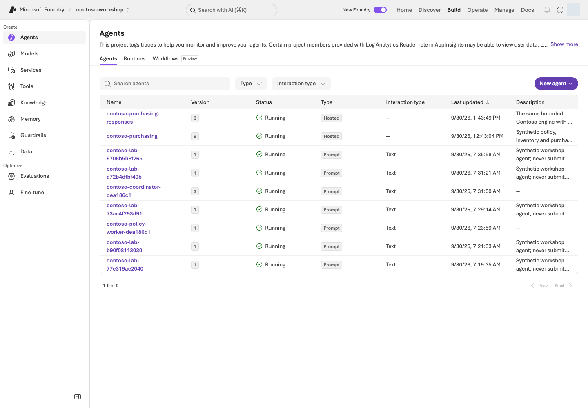

> **완성할 결과:** 이 저장소의 구매 도우미 코드를 패키징하고 로컬·Azure에서 호출합니다.

<div class="lab-brief" markdown="1">

**진행 방식:** 선택 심화 · L11 검색 자원과 배포 담당자의 준비가 필요합니다.

**먼저 할 일:** 전용 Python 환경에서 패키지를 만듭니다. 기본 Invocations 경로부터 진행하고 Optimizer용 adapter는 건너뜁니다.

**확인할 결과:** 패키지·로컬 응답·원격 버전 응답·세션 정지를 각각 확인합니다. 로컬 서버도 Azure 호출 시 비용이 듭니다.

</div>

## 목표

Prompt Agent는 instructions와 서비스 도구, **Hosted Agent는 직접 관리하는 실행 코드**입니다.
동봉 구현은 구조화된 요청·증거를 그대로 주고받기 위해 **Invocations protocol**을 사용합니다.
Responses·Voice·Teams protocol을 검증한 것으로 표시하지 않습니다.

## 개념과 실습 지도

**경험할 기능:** 내 PC에서 실행하던 에이전트 코드를 Foundry 서버로 옮깁니다.

**무엇이며 왜 중요한가요?** Hosted Agent는 직접 작성한 코드를 Foundry에서 실행합니다. 내 PC의 터미널이 없어도 함수를 실행할 서버가 필요할 때 선택합니다. 코드·데이터·설정·통신 규약(protocol)을 함께 맞춰야 합니다.

**어떻게 사용하나요?** 패키지 만들기 → 로컬 호출 → 승인된 배포 → 같은 버전 원격 호출 순서입니다. 기본 Invocations부터 진행하며 Optimizer용 Responses adapter는 선택입니다.

**어디서 실행하나요?** 터미널에서 실행·배포하고 포털에서 종류·버전을 확인합니다. [설정](../azure.yaml)·[패키징](../scripts/build_hosted.py)·[서버 입구](../hosted/main.py)·[업무 코드](../samples/hosted_runtime.py)를 순서대로 찾습니다.

## 준비

L11의 Search/index와 모델, Python **3.13**, azd **1.34.0**,
`azure.ai.agents` **1.0.0-beta.10** 조합을 기준으로 합니다.
지원 범위·지역은 공식 Hosted 문서를 확인하세요. 특정 구독 Owner를 학습자에게 요구하지 않습니다.
배포 담당자와 이미 준비된 프로젝트를 사용하는 학습자를 구분합니다.

### 먼저 경로 정하기

| 지금 상태 | 진행할 단계 | 완료로 기록할 범위 |
| --- | --- | --- |
| Azure 실행 승인 없음 | 전용 환경 준비 → 1단계 패키지 생성 | 패키징만. 서버 업무 호출·원격 배포는 미실행 |
| 프로젝트·Search와 호출 승인 있음 | 1 → 2단계 | 내 PC 서버의 실제 모델·검색 호출. Azure Hosted 배포 성공은 아님 |
| 배포·역할 변경까지 별도 승인 있음 | 1 → 2 → 3 → 4 → 5단계 | 정확한 원격 버전의 응답과 세션 중지까지 확인 |

먼저 같은 실습 폴더에 **L01의 `.env`·`results/azure-environment.json`과 L11의 `results/search.json`**이 있는지 확인합니다. 프로젝트 주소·언어·Search 대상이 서로 다르면 중단합니다. 다른 사람의 기록이나 화면의 버전 숫자를 복사하지 않습니다.

```bash
python3.13 -m venv .venv-live
source .venv-live/bin/activate
python -m pip install -r requirements-hosted.txt
python -m pip check
python scripts/check_sdk.py
```

<div class="command-explanation" markdown="1">

**명령 해설**

| 순서·명령 | 세부 동작과 옵션 | 결과·비용/변경 |
| --- | --- | --- |
| 1. `python3.13 -m venv .venv-live` | Hosted용 Python 3.13 가상환경을 만듭니다. | 로컬 폴더 생성. MAF 심화 환경과 섞지 않습니다. |
| 2. `source .venv-live/bin/activate` | 현재 셸의 Python을 새 환경으로 선택합니다. | 현재 터미널만 변경하며 Azure 자원은 건드리지 않습니다. |
| 3. `pip install -r requirements-hosted.txt` | Hosted 서버와 SDK의 고정 의존성을 설치합니다. | 패키지 다운로드·로컬 설치. 모델 추론 없음. |
| 4. `pip check` | 설치된 패키지들의 의존성 요구가 서로 충돌하는지 확인합니다. | 읽기 검사이며 오류가 있으면 다음 단계로 넘어가지 않습니다. |
| 5. `check_sdk.py` | 샘플이 사용하는 SDK 클래스와 호출 계약을 로컬에서 검사합니다. | import/API 계약 검사이지 원격 배포·모델 품질 검사 결과는 아닙니다. |

</div>

MAF 실습용 `.venv-advanced`는 별도입니다. 서로 다른 `azure-ai-projects` 제약을 단순 병합하지 않습니다.

Windows는 L01과 같은 방식으로 `py -3.13`을 사용해 `.venv-live`를 만들고, 이후 `.venv-live\Scripts\python.exe`로 실행합니다. 아래 `curl`은 Windows에서 `curl.exe`로 실행합니다. macOS/Linux의 `source` 명령은 PowerShell에 붙여넣지 않습니다.

## 실행

### 1. Azure 호출 없이 패키지부터 만들기

```bash
python scripts/build_hosted.py
```

<div class="command-explanation" markdown="1">

**명령 해설**

| 순서·명령 | 세부 동작과 옵션 | 결과·비용/변경 |
| --- | --- | --- |
| 1. `build_hosted.py` | 체크인된 실행 코드·정책·설정에서 배포용 디렉터리와 ZIP, 파일 해시 명세를 생성합니다. | 로컬 `.build/` 산출물 변경. Azure 배포 없음. `.env`나 평가 정답을 압축에 넣지 않습니다. |

</div>

`.build/contoso/`와 `.build/contoso-code.zip`을 만듭니다.
Optimizer용 Responses 프로필은 `.build/contoso-responses/`에 별도로 생성합니다.
이 분리 덕분에 Optimizer의 설정 로딩을 고쳐도 이미 검증한 기본 Invocations 런타임을 바꾸지 않습니다.
구매 정책·재고·instructions·실행 코드·고정 의존성만 포함하고,
`.env`, 인증, 평가 정답, 기존 결과, 개인 환경은 포함하지 않습니다.
`package-manifest.json`의 파일별 hash와 runtime contract를 확인합니다.
외부 샘플 저장소를 복제할 필요가 없습니다.

### 2. 로컬 실행과 호출

서버 터미널에서 다음 동봉 helper를 실행합니다. L01/L11의 `.env`와 `results/search.json`에서
허용된 비밀 없는 값만 자식 프로세스로 전달합니다.

```bash
python scripts/run_hosted_local.py
```

<div class="command-explanation" markdown="1">

**명령 해설**

| 순서·명령 | 세부 동작과 옵션 | 결과·비용/변경 |
| --- | --- | --- |
| 1. `run_hosted_local.py` | 기본 Invocations 서버를 loopback 8088 포트에서 시작하고 안전한 환경 설정을 자식 프로세스에 전달합니다. | 서버 터미널을 켜 둡니다. 로컬 실행 위치라도 실제 요청은 Azure 모델·검색을 사용할 수 있습니다. 끝나면 Ctrl+C로 중지합니다. |

</div>

다른 터미널에서도 **같은 실습 폴더와 `.venv-live`를 선택**합니다. 서버 터미널은 켜 둔 채 아래 명령을 한 줄씩 실행합니다. 두 번째 터미널에서 새 가상환경을 만들거나 서버를 또 시작하지 않습니다.

```bash
curl --fail http://127.0.0.1:8088/readiness
python samples/hosted_client.py invoke --local
python samples/hosted_client.py invoke --local --live
```

<div class="command-explanation" markdown="1">

**명령 해설 — 두 번째 터미널에서 실행합니다.**

| 순서·명령 | 세부 동작과 옵션 | 결과·비용/변경 |
| --- | --- | --- |
| 1. `curl --fail .../readiness` | 로컬 서버의 준비 endpoint를 읽습니다. `--fail`은 HTTP 오류를 실패로 처리합니다. | 서버 연결 확인이며 구매 질문·모델 호출은 아닙니다. |
| 2. `invoke --local` | 호출 대상을 로컬로 선택하지만 `--live`가 없어 계획만 출력합니다. | 서버 업무 요청·Azure 추론 없음. `--local`만으로 실제 호출을 허용하지 않습니다. |
| 3. `invoke --local --live` | 로컬 서버에 합성 구매 요청을 실제 보냅니다. `--live`는 서버 뒤의 모델·Search 호출 비용을 허용한다는 의미입니다. | 응답 JSONL과 함수·인용·계약 검사를 확인합니다. 로컬 결과를 Azure Hosted 배포 성공으로 표시하지 않습니다. |

</div>

**로컬 서버도 실제 Azure 모델·검색을 사용하므로 호출에는 비용이 발생합니다.**
기본 bind는 loopback이며 인증 없는 개발 서버를 외부에 노출하지 않습니다.
한 요청은 도구 계획 → 근거 답변 → 출처 대응 확인으로 나눕니다.
앞의 두 모델 출력은 각각 2048토큰, 출처 확인은 512토큰으로 제한합니다.
도구 최대 8회, SDK 재시도 0을 유지합니다.

<details class="optional-path" markdown="1">
<summary>구현 참고: 서버가 검색·도구·근거 답변을 나누는 방식</summary>

현재 엔진은 모델 실행 **전에** 서버가 질문별 검색과 작은 합성 정책 13절의 실제 조회를 수행합니다.
모델의 검색 함수 선택을 기다리지 않습니다. 응답은 내부적으로 `answer`·`citation_ids` JSON이며,
인용은 실제 반환된 절 중 모델이 선택한 것만 렌더링합니다. 검색/인용 누락은 성공이 아니라 오류입니다.
`tool_calls`의 `execution=server_required`는 실제 서버 검색이며 모델이 호출했다고 가장한 기록이 아닙니다.
현재 공통 엔진은 SKU만으로 `get_stock`을 선실행하지 않습니다. 요청 의도와 유효한 초안 인수로 허용 도구를 결정하고, 각 호출을 실행 전에 재검사합니다. 잘못된 초안 수량 때문에 별도로 요청하지 않은 재고 조회를 하지 않습니다.
초안 생성은 별도 함수이며 실제 주문·결제를 수행하지 않습니다. 수량 제한의 근거는 실행에 사용한 `tool_definitions`로 대조합니다.

허용된 업무 도구가 없으면 도구 계획 호출을 건너뜁니다. 도구 실행 단계에는 답변 JSON 형식을 강제하지 않고 필요한 함수를 최대 두 차례에 걸쳐 실행하게 합니다.
그 다음 답변 전용 단계에서 실제 결과와 문서에 근거한 엄격한 JSON을 생성합니다.
도구를 호출하겠다는 계획 문장은 답변이나 실행 증거로 게시하지 않습니다.

초안 도구 인수는 사용자가 명시한 SKU와 하나의 명확한 정수 수량에 연결돼야 합니다.
모델이 빠진 수량을 1로 채우거나 11개를 10개로 줄여 제안해도 코드가 실행 전에 거절합니다.
답변 단계에도 실제 함수 정의를 전달하여 도구의 1~10 입력 제약을 회사 정책으로 혼동하지 않게 합니다.
마지막 출처 확인 단계는 실제 검색 자료와 작성된 답변만 보고 근거를 선택하며,
두 모델의 실제 선택을 합쳐 표시합니다. 원문 답변과 출처 선택 응답 ID는 각각 보존합니다.
초안·승인·권한 판단의 필수 인용이 빠지면 오류로 처리하며 서버가 자동 보충하지 않습니다.

현재 패키지는 `agent-v2.txt`를 사용합니다. 명시적인 요청·도구 권한·실제 결과·주장별 인용을 구분하며, 지침 준비를 실제 Azure 검증과 혼동하지 않습니다. 자신의 패키지 해시와 실행한 버전의 원문을 대조합니다.

</details>

**지금 확인할 세 가지:** `/readiness`의 성공은 서버 접속 확인, `invoke --local`은 계획 출력, `invoke --local --live`의 응답은 실제 업무 실행입니다. 출력의 원본 파일에서 `tool_calls`·인용·`order_submitted=false`를 확인한 뒤에만 원격 배포 단계로 넘어갑니다.

### 3. 준비된 프로젝트에만 배포하기



**화면 따라 읽기:** **Type**에서 Hosted/Prompt를, **Version**에서 코드·정의의 버전을 구분합니다. 이름을 열어 배포 설정과 protocol을 확인하고, CLI `show`의 버전과 대조하세요. 사진의 버전 숫자는 촬영 환경의 예이며 그대로 복사할 값이 아닙니다. **Running 표시는 개별 세션 compute의 활성 여부·전체 비용·업무 품질 통과를 대신 증명하지 않습니다.**

관리자가 L01의 동봉 IaC로 만든 환경이라면:

```bash
python scripts/configure_hosted.py
azd deploy contoso-purchasing --no-prompt
azd ai agent show contoso-purchasing --output json
python scripts/runtime_roles.py --agent contoso-purchasing --live
```

<div class="command-explanation" markdown="1">

**명령 해설 — 배포 담당자의 승인 범위에서만 수행합니다.**

| 순서·명령 | 세부 동작과 옵션 | 결과·비용/변경 |
| --- | --- | --- |
| 1. `configure_hosted.py` | 소유 환경 receipt의 프로젝트·리전·모델·Search 값을 azd 환경에 연결합니다. 다른 프로젝트를 자동 발견해 선택하지 않습니다. | 로컬 azd 환경 설정 변경. 이미 제공된 별도 프로젝트에는 아래 수동 환경 설정 경로를 사용합니다. |
| 2. `azd deploy contoso-purchasing --no-prompt` | `azure.yaml`의 해당 서비스만 실제 배포합니다. `--no-prompt`는 대화형 확인 생략이지 dry run이 아닙니다. | 원격 배포·새 immutable version과 비용 가능. 이 CLI에는 `--live`가 필요하지 않습니다. |
| 3. `azd ai agent show ... --output json` | 배포된 agent metadata를 구조화된 JSON으로 읽습니다. | 숫자 버전·대상 프로젝트를 기록합니다. 아직 업무 요청을 보낸 것은 아닙니다. |
| 4. `runtime_roles.py --agent ... --live` | 소유 agent의 runtime ID에 프로젝트·Search 읽기·모델 호출의 최소 범위 역할을 설정합니다. | 관리자 권한 변경입니다. 개발자의 로그인 역할과 다르며, 임의 agent나 구독 전체 역할을 허용하지 않습니다. |

</div>

학습자에게 별도로 provision된 프로젝트를 제공했다면 `azd env new`와 `azd env set`으로
`AZURE_AI_PROJECT_ID`, `AZURE_AI_PROJECT_ENDPOINT`, `AZURE_SUBSCRIPTION_ID`,
`AZURE_TENANT_ID`, `AZURE_RESOURCE_GROUP`, **`AZURE_LOCATION`** 및 모델/Search 값을 설정합니다.
이는 자격 증명이 아니라 환경 바인딩입니다. `azd env get-values` 전체를 공개 로그에 출력하지 마세요.
`azd env new`는 로컬 환경 이름을 만들고, `azd env set`은 그 환경의 한 구성값을 저장합니다. 자체적으로 모델을 배포하는 명령은 아니지만 이후 `deploy`의 대상을 바꾸므로 값을 넣기 전에 프로젝트·구독을 대조합니다. `get-values`는 설정 전체를 읽는 명령이지 학습 결과 검사가 아닙니다.

`AZURE_LOCATION`은 프로젝트의 실제 리전 이름입니다. 코드 배포에서 이 값이 없으면 실패합니다.
`scripts/configure_hosted.py` 경로는 동봉 관리 스크립트가 만든 소유 receipt를 사용하며,
강사가 제공한 별도 프로젝트를 사용할 때는 그 프로젝트의 실제 값으로 azd 환경을 구성해야 합니다.

동봉 `azure.yaml`은 **code deployment**이며 Docker/ACR가 필수는 아닙니다.
이 파일로 무심코 `azd provision`을 실행하지 않습니다. 리소스 생성은 L01 관리 경로입니다.
배포마다 새 immutable version이 생깁니다. agent runtime identity에는 해당 Search 읽기 역할만 부여합니다.

### 4. 정확한 버전 원격 호출

```bash
python samples/hosted_client.py invoke --version 실제숫자 --live
```

<div class="command-explanation" markdown="1">

**명령 해설**

| 순서·명령 | 세부 동작과 옵션 | 결과·비용/변경 |
| --- | --- | --- |
| 1. `invoke --version ... --live` | 기본 `contoso-purchasing` Invocations 서비스의 정확한 숫자 버전에 새 세션을 만들고 합성 질문을 한 번 보냅니다. azd와 `.env`의 프로젝트가 일치해야 합니다. | 실제 Hosted·모델·Search 비용과 응답 evidence 생성. `finally`에서 같은 세션 compute의 중지를 확인합니다. agent 삭제는 하지 않습니다. |

</div>

`show`의 실제 version을 넣습니다. 새 version-bound session에서 호출하고 `finally`에서
**compute만 stop**합니다. 응답·내부 model response ID·tool call ID·citation·trace ID가 반환되며,
로컬 package contract와 원격 contract가 다르면 실패합니다.
trace ID가 없으면 추측하지 않고 미수집으로 남깁니다.

배포·session 관리는 azd, 동봉 Invocations client의 본문 수집은 **서비스가 반환한 endpoint에
Entra-authenticated HTTP JSON 요청**을 사용합니다. CI의 azd stdout에 추가 출력이 섞인 실제 사례를
수정한 것으로, CLI 화면 출력을 안정적인 API JSON 계약으로 가정하지 않습니다.

### 5. 기본 도구를 실제로 확인하기

질문은 “NB-14 2대의 정책과 재고를 확인하고 구매 요청 초안만 만들어줘”입니다.
결과에서 `search_policies`, `get_stock`, `prepare_purchase_request`의 인수와 결과를 확인합니다.
총액은 **2,900,000원**, 두 승인 역할, `order_submitted=false`여야 합니다.
Toolbox를 별도 연결할 때는 L07의 인증 주체와 1회 승인 정책을 그대로 유지합니다.

| 비교 항목 | 로컬 실행에서 적을 값 | 원격 실행에서 적을 값 |
| --- | --- | --- |
| 대상 | loopback 8088, 패키지 contract | 자신의 프로젝트·서비스 숫자 version·contract |
| 구매 결과 | 실제 함수 금액·승인 역할·인용 | 같은 업무 조건의 실제 결과. 문장 일치가 아니라 근거 비교 |
| 종료 | 서버 터미널 Ctrl+C | 응답과 함께 기록된 해당 세션의 중지 확인 |

이 표는 작성 틀이며 실행 결과를 미리 채운 것이 아닙니다. 한쪽만 실행했으면 다른 쪽은 미실행으로 남깁니다.

## 성공 기준

패키징·서버 시작·로컬 업무 결과·배포·같은 버전 원격 업무 결과를 각각 확인했습니다.
hash·도구·citation이 연결되고, 배포만 성공한 상태를 품질 통과로 표시하지 않습니다.

## 막혔을 때

health 실패는 entry point/의존성, 502는 보존된 upstream 오류, 403은 runtime ID의
모델/Search 역할부터 확인합니다. 424 cold start는 로그를 확인하고 제한된 횟수만 재시도합니다.
오류 문장을 HTTP 200의 정상 답변으로 바꾸지 않습니다.

## 정리

로컬 서버는 시작한 터미널의 Ctrl+C로 종료합니다. 중단된 실행은
`python scripts/stop_sessions.py`로 **기록된 세션만** 정지합니다.
agent/version/session 파일·Azure 자원은 남습니다. 남은 storage·로그·Search 비용을 L19에 기록합니다.

Hosted의 `/app`은 읽기 전용입니다. 원격 원시 증거는 세션의 `$HOME/.contoso/evidence`에만
기록하고 코드 폴더에 쓰지 않습니다. 이를 패키지에 포함하지 않습니다.
