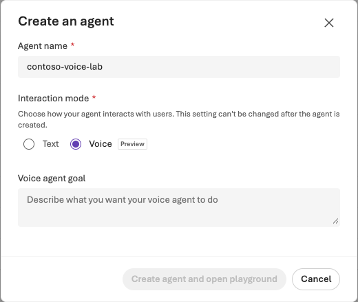

> **완성할 결과:** 짧은 구매 안내를 말로 듣고, 끼어들기·침묵·세션 종료까지 검증한 음성 agent.

<div class="lab-brief" markdown="1">

**진행 방식:** 선택 심화 · Voice Preview, 마이크·스피커와 음성 비용 승인이 필요합니다.

**먼저 할 일:** 지원 여부를 확인합니다. 지원하지 않으면 생성하지 말고 대화 시나리오만 작성합니다.

**확인할 결과:** 실행했다면 수량 2→1 수정·끼어들기·종료 상태를 기록합니다. 설정 화면을 본 것은 음성 실행이 아닙니다.

</div>

## 목표

**Speech STT/TTS, 실시간 Voice Live, 음성 Prompt Agent는 같은 말이 아닙니다.** Speech의 GA 기능과 Voice Agent의 Preview 경험을 구분합니다.

## 개념과 실습 지도

**경험할 기능:** 음성 인식·음성 합성·실시간 turn detection·사용자 끼어들기·세션 종료입니다.

**무엇이며 왜 중요한가요?** STT는 소리를 글로, TTS는 글을 소리로 바꾸며 Voice Agent는 그 사이의 대화 상태와 응답 시점을 함께 다룹니다. 텍스트에서 맞는 답도 음성으로는 금액을 잘못 듣거나 수정된 수량을 놓칠 수 있습니다. 내용 정확도뿐 아니라 언제 듣고 말하고 멈추는지까지 검사해야 실제 사용성이 생깁니다.

**어떻게 사용하나요?** 짧은 합성 문장으로 시작해 수량 인식→확인 질문→끼어들기→수량 수정→종료를 차례로 시험합니다. 마이크 권한은 사용자가 브라우저에서 직접 허용합니다. 설정을 바꾸기 전 세션을 끝내고 결과 transcript와 지연을 비교하세요.

**어디서 실행하나요?** 음성 입력은 실제 마이크·스피커가 있는 브라우저에서 진행합니다. 이 가이드의 Headless 포털 캡처는 설정 위치를 보여 줄 뿐 실제 음성 대화 성공 증거가 아닙니다. 제공 지시는 이 장의 합성 시나리오이며 실제 고객 통화나 custom voice 학습은 포함하지 않습니다.

## 준비

지원 지역·프로젝트의 voice preview 접근, 호환 voice 모델, 마이크/스피커와 승인된 브라우저가 필요합니다. 사용량·세션 비용을 확인하고 짧게 테스트합니다.

## 실행

### 1. Voice Agent 만들기

**Build → Agents → New agent → Build an agent → Interaction mode: Voice**를 선택합니다. 생성 창은 interaction mode를 생성 후 변경할 수 없다고 안내하므로 별도 음성 실습 agent를 사용합니다. 현재 UI의 model·언어·voice·turn detection 기본값을 기록합니다.



**화면 따라 읽기:** **Agent name**은 다른 실습과 구분되는 합성 이름, **Interaction mode**는 **Voice Preview**입니다. 촬영에서는 이 두 입력만 선택하고 **Cancel**로 닫았습니다. **Create agent and open playground**를 누르지 않았으며 음성 agent·마이크 세션·유료 음성 호출을 만들지 않았습니다. Preview 선택 화면을 봤다는 사실과 실제 음성 대화 완료는 구분합니다.

실제로 진행하는 학습자는 **Voice agent goal**에 “합성 Contoso 구매 규정을 한국어로 짧게 안내하고 실제 주문·승인은 수행하지 않는다”처럼 목표를 입력합니다. 캡처에서는 이 칸을 비워 생성 버튼이 비활성입니다. 승인된 환경에서 생성한 뒤 Playground의 instructions·모델·음성·언어 설정을 검토하며, 자동으로 채워진 설정을 확인 없이 사용하지 않습니다.

Instructions:

```text
너는 Contoso 구매 안내 실습 도우미다.
한국어로 짧게 말하고 한 번에 한 가지를 확인한다.
금액과 수량을 다시 확인한다.
실제 주문·승인·결제를 수행하지 않는다.
도구가 실패하면 실패를 알리고 성공을 주장하지 않는다.
긴 표나 전체 식별 번호를 음성으로 읽지 않는다.
```

L05의 지식을 연결할 수 있는지 지원 여부를 확인합니다. 없는 지식을 기억하는 것처럼 답하면 안 됩니다.

### 2. 짧은 대화 시작하기

Save 후 **Start session**을 선택하고, 필요한 경우 본인이 브라우저 마이크 접근을 허용합니다. “노트북 두 대를 구매하려고 해요”라고 말합니다.

### 3. 대화 품질 검사하기

한 세션에서 아래 순서를 한 번 진행합니다. 침묵 1초는 **비교할 입력 조건**이지 모든 음성 앱의 합격 기준이 아닙니다.

| 입력·확인할 것 | 어떻게 판단하나요? | 실패하면 다음 행동 |
| --- | --- | --- |
| “노트북 두 대” 후 transcript | 수량 2를 인식하고 확인 | transcript부터 틀리면 마이크·인식 언어 확인. 텍스트는 맞는데 답이 틀리면 지침/대화 상태 확인 |
| “노트북…” → 1초 침묵 → “…두 대요” | 의도한 한 발화가 나뉘었는지 기록 | 세션 종료 후 turn detection 설정 한 항목만 비교. 서비스 기본값을 보편 기준으로 단정하지 않음 |
| agent 발화 중 “두 대가 아니라 한 대요” | 이전 음성이 멈추고 다음 답이 수량 1을 확인 | 중단 시각과 transcript를 대조. 인식 누락과 오래된 응답 재생을 구분 |
| `End session` 후 상태 | 종료 표시, 오디오 종료, 해당 세션의 마이크 사용 종료 | 브라우저 탭을 닫았다는 사실로 대신하지 말고 세션 상태 확인 |

발화 끝 → 첫 음성까지 지연은 화면 측정값을 쓰고, 직접 잰 값은 **수동 측정**으로 표시합니다. 도구가 없는 세션에서 도구 실패 처리를 검증했다고 쓰지 않습니다. 도구를 연결했다면 별도 승인된 실패 입력에 대해 실행 기록과 실패 안내를 함께 확인합니다. 설정 변경 전에 세션을 종료하고, 동일 입력·변경 항목·차이를 기록하세요.

### 4. Foundry Tools를 목적별로 분리하기

| 기능 | 간단한 추가 과제 |
| --- | --- |
| Speech-to-text | 같은 합성 문장 3회 인식해 수량·금액 오류 확인 |
| Text-to-speech | “1,450,000원”의 자연스러운 발음 확인 |
| Language / PII | 합성 `lab.user@example.invalid`의 탐지·마스킹 비교 |
| Language / 분류·요약 | 구매/재고/규정 문의 3가지 라벨 비교 |
| Translator | 같은 규정 문장을 한·영으로 번역해 금액·의무 표현 보존 검사 |

Translator의 `2026-06-06` GA는 v3.0와 요청·응답 계약이 달라질 수 있습니다. 기존 `text` payload 예제를 새 버전과 무심코 섞지 말고 해당 버전의 `inputs`/`value` 등 계약을 확인합니다.

### 5. 조건부: Avatar·실시간 전송

지원되는 browser/avatar 설정이나 Hosted Agent의 실시간 WebSocket 경로는 별도 실험입니다. 전화 연결, 실제 고객 통화, custom voice 학습은 기본 코스에 포함하지 않으며 별도 동의·정책·허가가 필요합니다.

## 성공 기준

transcript·실제 수량 2→1·끼어들기 처리·지연의 측정 방식·종료 상태를 기록했습니다. 보지 못한 항목은 미확인으로 남기고, “소리가 났다”만으로 완료하지 않습니다.

## 막혔을 때

Voice 모드가 없으면 preview 접근·지원 지역을 먼저 확인합니다. 마이크·모델·voice 언어·브라우저 출력 장치를 점검합니다. 텍스트 agent를 대체 생성한 뒤 voice 성공이라고 기록하지 않습니다.

## 정리

**End session**을 누르고 활성 세션이 남지 않았는지 확인합니다. 음성·transcript의 보존과 접근 범위를 정합니다.
