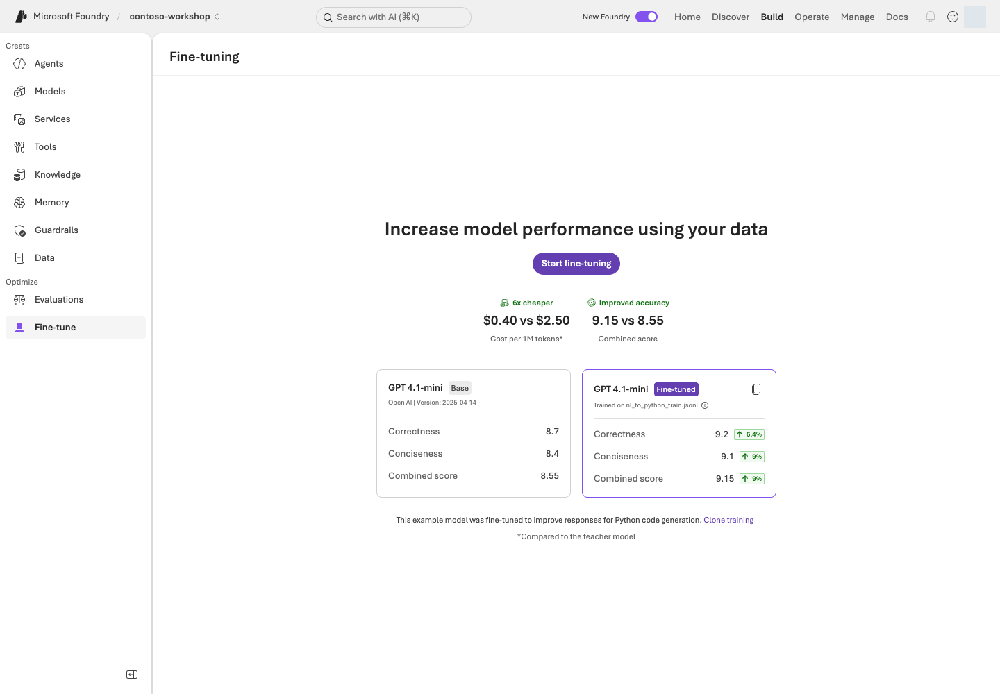

> **완성할 결과:** 개선할 대상을 올바르게 선택하고, 학습 가능한 데이터와 과적합을 막는 비교 절차를 준비합니다.

## 목표

**새로운 사실은 RAG, 지시 문제는 prompt, 반복적으로 학습할 행동은 fine-tuning**부터 검토합니다. 기본 모델이 최신이라고 모든 학습 방식을 지원하지는 않습니다.

## 개념과 실습 지도

**경험할 기능:** 실패 원인 분류, prompt/Agent Optimizer 후보 비교, SFT 데이터 형식, 조건부 fine-tuning입니다.

**무엇이며 왜 중요한가요?** Prompt 최적화는 모델에 주는 지시·도구 설명 등을 바꾸고, fine-tuning은 예시나 보상으로 모델의 행동을 학습합니다. 둘 다 없던 회사 사실을 안전하게 최신화하는 RAG의 대체물이 아닙니다. 또 optimizer는 후보 생성과 평가를 여러 번 수행하므로 보통 단일 질문보다 비용이 큽니다. “job 성공”과 “기존보다 좋아진 후보”를 구분해야 불필요한 승격을 피할 수 있습니다.

**어떻게 사용하나요?** 먼저 실패가 검색·지시·형식·반복 행동 중 어디에 있는지 분류합니다. 같은 dev 기준으로 baseline과 후보를 비교하고, 개선이 확인된 후보만 별도 독립 시험의 대상으로 삼습니다. Fine-tuning은 작은 로컬 seed 파일을 읽어 형식을 배우는 단계와 실제 유료 training job을 명확히 나눕니다.

**어디서 실행하나요?** [optimizer_lab.py](../samples/optimizer_lab.py), [optimizer 전용 adapter](../hosted/optimizer_responses.py), [prepare_tuning.py](../samples/prepare_tuning.py)가 실제 코드입니다. 지시 원본은 [agent-v6.txt](../data/prompts/agent-v6.txt)처럼 배포 버전과 일치하는 파일을 선택합니다. 포털은 Optimize/Fine-tune 설정·진행·결과 비교에 사용합니다.

## 준비

L08의 baseline과 실패 사례, 별도 dev/holdout, 학습/평가/배포 비용 승인이 필요합니다. 실제 training job 제출은 선택이며 수십 분~수시간 이상 대기할 수 있습니다.

## 실행

### 1. 원인을 먼저 분류하기

| 실패 원인 | 우선 해결 |
| --- | --- |
| 회사 규정을 모름 | 문서 검색·지식 연결 |
| 올바른 문서를 못 찾음 | chunk·검색·권한·freshness |
| 도구 선택/설명이 모호함 | schema·description·instructions |
| 출력 형식만 흔들림 | structured outputs·검증 |
| 충분한 예시가 필요한 반복 행동 | fine-tuning 비교 |

### 2. Prompt / Agent Optimizer 실험

Agent의 **Optimize** 경험이 제공되면 baseline version, dev 데이터, 평가 기준, judge/optimizer 모델, 후보 수와 예상 비용을 확인합니다. **Agent Optimizer는 GA 표 기준 Limited preview**입니다. 접근이 없으면 차단으로 기록합니다. dev 실패를 바탕으로 prompt를 수동 수정하는 별도 비교 루프는 선택 안내입니다.

Prompt agent는 instructions·함수 description·모델 선택 등을, Hosted agent는 optimizer-ready 구성에 따라 instructions·skills·tool description·모델 등을 개선합니다. 모델 가중치를 학습하는 fine-tuning과 다릅니다.

도구를 포함한 optimizer/evaluation은 실제 도구를 여러 번 호출할 수 있습니다. 비운영 읽기/초안 도구로 제한합니다. client-side 함수의 description 최적화가 실제 함수 실행 품질까지 평가했다는 뜻은 아닙니다.

후보를 무조건 최신 버전으로 승격하지 마세요. 변경 diff·품질·토큰·지연을 확인하고 **사용하지 않은 holdout**으로 다시 평가합니다.

동봉 native Agent Optimizer 경로:

```bash
python samples/optimizer_lab.py --agent 실제-agent --version 실제숫자 --optimizer-deployment 지원-optimizer-배포 --prompt-file data/prompts/해당버전의지시.txt
AZURE_DEV_USER_AGENT=microsoft_foundry_skill python samples/optimizer_lab.py --agent 실제-agent --version 실제숫자 --optimizer-deployment 지원-optimizer-배포 --prompt-file data/prompts/해당버전의지시.txt --live
```

<div class="command-explanation" markdown="1">

**명령 해설 — 새 최적화 job은 별도의 실행 비용 승인 후에만 제출합니다.**

| 순서·명령 | 세부 동작과 옵션 | 결과·비용/변경 |
| --- | --- | --- |
| 1. `optimizer_lab.py` | `--agent/--version`은 baseline, `--optimizer-deployment`는 reflection 모델 배포, `--prompt-file`은 그 baseline과 같은 지시 파일입니다. `--live` 없이 제출 계획을 읽습니다. | Azure job 생성 없음. suite·dev 건수·후보/시간 제한·holdout 0건을 확인합니다. |
| 2. 같은 명령에 `--live` | 검토한 설정으로 native optimizer를 실제 제출하고 제한 시간 동안 결과를 관찰합니다. `AZURE_DEV_USER_AGENT`는 명령 프로세스 식별값이지 인증 토큰이 아닙니다. | 여러 model/agent/evaluator 호출과 Hosted 비용 가능. 결과·경고·취소/세션 중지까지 확인하며 후보를 자동 승격하지 않습니다. |

</div>

첫 명령에서 제출될 **현재 suite의 전체 dev 건수·holdout 0건**, 후보 최대 2개, stall 최대 1회를 확인합니다.
`DEFAULT_SUITE`가 기본값이며 `--suite`로 명시적으로 선택할 수도 있습니다. dev 건수를 하드코딩하지 않습니다.
새로 봉인된 holdout은 optimizer가 파일을 열거나 제출하지 않습니다.
`load_cases(suite, split="dev")`로 dev 파일만 읽습니다. 전체 split을 읽은 뒤 필터링하지 않습니다.
suite·dev ID/hash·실제 제출 설정을 원본 evidence에 기록하며, holdout 기반의 품질 통과를 주장하지 않습니다.
`payload(...)`와 CLI 모두 `DEFAULT_SUITE`를 따릅니다. legacy 데이터의 진단은
`suite="legacy-v1"`을 명시해야 하며, 새 legacy job은 제출하지 않습니다.

Hosted native 최적화는 `AZURE_DEV_USER_AGENT=microsoft_foundry_skill azd deploy contoso-purchasing-responses --no-prompt`로 준비한
**Responses adapter**를 대상으로 합니다. Invocations agent를 그대로 제출하면 서비스가 400으로 거절합니다.
이 명령의 `contoso-purchasing-responses`는 `azure.yaml`의 별도 서비스 이름입니다. `deploy`는 실제 원격 버전을 생성하고 `--no-prompt`는 확인 질문만 생략하므로, L14에서 이미 배포한 올바른 버전이 있으면 반복 배포하지 않습니다.
현재 optimizer 전용 진입점은 **`hosted/optimizer_responses.py`**, 별도 빌드 경로는
**`.build/contoso-responses`**입니다. 검증된 primary runtime과 빌드 hash는 변경하지 않았습니다.
optimizer 모델은 서비스가 요구하는 모델 계열을 별도 확인합니다.
이번 API는 `gpt-5-mini`를 reflection 모델로 허용하지 않았으며, 지원 목록을 확인한
`gpt-5.1` 배포로 구분했습니다. 추론 모델 지원과 optimizer reflection 모델 지원은 다릅니다.
Hosted 패키지는 `azure-ai-agentserver-optimization==1.0.0b1`의 `load_config()`와
`.agent_configs/baseline/`을 포함합니다. baseline model은 패키징 시 승인된 배포 이름으로 고정하며,
환경이 없을 때 만든 오프라인 패키지는 실행 전에 다시 생성해야 합니다.
전용 adapter는 resolver에 credential을 전달하고, 쓰기 가능한 **HOME 아래**에 config를 캐시합니다.
모델 상속은 **정상적으로 해석된 instruction-only optimizer overlay가 `model`을 생략하거나 `null`로 둔 경우**에만
패키징된 baseline model을 명시적으로 사용하는 동작입니다. baseline 답변을 복사하거나 임의의 환경 기본 모델로
오류를 덮는 fallback이 아닙니다. 잘못된 명시적 모델, 유효하지 않은 config, resolver 해석 실패는 거절합니다.
client-side 함수를 서버가 실행할 수 없는 agent를 대상으로 삼지 않습니다.
기존 실험은 `agent-v4.txt`를 포함한 `contoso-purchasing-responses` version `2`가 대상이었습니다.
현재 성공한 native 실행은 전용 Responses **version `3` / `agent-v6.txt`** 조합입니다.
다른 baseline에는 `--prompt-file data/prompts/해당버전의지시.txt`로 **배포된 지시와 같은 파일**을 지정합니다.
새 `--live` job은 `--prompt-file`이 필수입니다. 함수/plan의 v4 기본값은 기존 진단용이며,
이를 생략한 채 새 버전으로 job을 제출할 수 없습니다. 최신 지시를 자동 추측하지 않습니다.
prompt 인자는 `data/prompts/*.txt`만 허용하며 데이터셋을 지시 파일로 읽지 않습니다.
inline 학습 데이터의 wire 필드는 `train_dataset.items`입니다(`dataset_items`가 아닙니다).

기본 시간 제한은 **600초(10분), job 생성 시각부터**입니다. `--max-seconds`는 60–1800의 정수만 허용합니다.
실측한 full-model 3단계 실행이 더 오래 걸리면 새 job에 `--max-seconds 1200`을 명시할 수 있습니다.
무제한 대기/자동 재시도가 아니며 후보 수·점수·평가 기준·dev/holdout 경계는 바꾸지 않습니다.
시간 제한은 새 job receipt에 저장합니다. `--resume`에는 **기록된 것과 같은** `--max-seconds`를 사용해야 하며,
예를 들어 1200초 job은 재개 시에도 `--max-seconds 1200`이 필요합니다. 기존 필드가 없는 receipt는 600초입니다.
재개는 원래 생성 시각의 deadline을 유지합니다. 취소된 600초 job을 더 긴 예산으로 되살리거나,
기존 job의 제한을 조용히 연장하지 않습니다.
SDK 자동 LRO polling 대신 `polling=False`로 제출하고 API 버전이 포함된 명시적 GET으로 조회합니다.
이 서비스의 `Operation-Location`에 API 버전이 없어 자동 polling이 실패했던 원본 기록도 보존합니다.
timeout·조회 실패·중단에서는 `finally`로 cancel하고 별도 **90초 제한** 안에서 terminal 상태를 확인합니다. 실패 경로에서도 terminal/outcome 원본을 남깁니다.
현재 정리 경로는 CLI나 baseline 전용 trace만 보지 않고 프로젝트 SDK의 페이지 처리된 세션 목록을 새로 조회합니다. **6회 확인, 총 180초, 회차별 목록 100건, 서로 다른 소유 세션 최대 10건**으로 제한합니다. 재활성화된 세션을 다음 회차에서 다시 중지할 수 있으므로 전체 stop 요청은 최대 60회이며 각 요청 뒤 최대 6회 읽기로 확인합니다. SDK 재시도는 없습니다. 마지막 두 확인에서 새 실행이 없어야 완료로 기록합니다.
후보가 `draft-...` 버전으로 나타나면 해당 버전의 optimizer candidate ID와 resolver가 기록된 job·프로젝트에 속하는지 확인합니다. 실행 전 snapshot의 세션, 다른 job·버전은 보존합니다. 늦게 생성된 baseline은 기록된 전용 버전과 job 종료 뒤 180초까지의 생성 범위로 제한합니다. 같은 baseline에 다른 작업을 동시에 실행하지 않습니다.
중지 후 같은 ID의 비활성 상태를 다시 읽고, 이미 검증한 ID는 서비스가 중지 때 `created_at`을 바꾸어도 잊지 않습니다. 마지막 확인에서 새 세션이 나오거나 조회·소유권·중지 확인이 실패하면 정리는 미완료입니다. 결과는 관찰한 시간 범위의 증거이지 앞으로도 세션이 생기지 않는다는 보장이 아닙니다.
Responses adapter는 동시 실행 gate 대기 뒤 취소 여부를 다시 확인하므로 취소된 대기 요청이 새 추론을 시작하지 않습니다. 이미 진행 중인 동기 요청은 기존 시간 제한 안에서 끝나며 즉시 종료를 보장하지 않습니다.
취소/중지 확인이 실패하면 **아직 실행 중일 수 있음**으로 보고합니다.
기존 job/receipt를 덮어쓰거나 리소스를 삭제하지 않습니다. 후보는 자동 배포/승격하지 않습니다.

| 관측 결과 | 기록할 판정 |
| --- | --- |
| `succeeded`지만 reflection failure/authentication/timeout 경고 | **operational_failure** — 성공으로 바꾸지 않음 |
| reflection/evaluation이 정상 실행되고 `max_stalls`에 따라 개선 없이 종료 | **executed_no_improvement** — 정상 실행이며, 품질 개선을 주장하지 않음 |
| baseline만 있고 reflection 실행 증거 없음 | **reflection_unverified** |
| 후보의 변경 내용 누락, 평가 행 누락/오류, partial 결과 | 불완전한 증거 또는 운영 실패 — 개선 완료가 아님 |

별도 native evaluation의 `completed`, 행 수, `errored=0`도 확인합니다.
서비스 상태나 baseline 점수 하나만으로 정상 최적화/품질 통과를 판단하지 않습니다.
사람의 후보 검토는 선택 안내이며 `human_review_completed=false`를 사실대로 유지합니다.

서비스 접근이 차단되면 **native optimizer 차단**으로 기록합니다. 선택적으로 dev의
실제 실패를 보고 별도 작성한 후보를 native optimizer 결과처럼 표시하지 않습니다.
후보 파일과 변경 사유를 남기고 L08의 같은 dev 기준으로 비교한 뒤 holdout을 한 번 확인합니다.

azd의 자동 suite 생성은 최소 15 samples를 요구할 수 있습니다. 수를 맞추려고 사례를
복제하거나 봉인된 holdout을 넣지 않습니다. 동봉 SDK runner는 선택한 suite의 전체 dev만
직접 제출하며, 자동 생성 CLI의 지원 범위와 구분합니다.
기존 legacy-v1 작업은 원래 receipt로 조회만 재개할 수 있고 새 legacy 작업 제출은 거절합니다.
이 경로는 데이터 파일을 다시 읽거나 작업을 재제출하지 않습니다.

```bash
AZURE_DEV_USER_AGENT=microsoft_foundry_skill python samples/optimizer_lab.py --agent contoso-purchasing-responses --version 2 --optimizer-deployment contoso-reflection --suite legacy-v1 --resume 실제-기록된-job-id --live
```

<div class="command-explanation" markdown="1">

**명령 해설 — 과거 소유 receipt가 있을 때만 쓰는 조회/정리 경로입니다.**

| 순서·명령 | 세부 동작과 옵션 | 결과·비용/변경 |
| --- | --- | --- |
| 1. `--suite legacy-v1 --resume ...` | `--resume`의 job ID는 기존 receipt와 같아야 합니다. agent·버전·optimizer 배포도 원래 기록과 대조합니다. | 새 job·새 데이터 제출은 없지만 원격 상태를 읽고 필요 시 제한된 취소/세션 정리를 수행합니다. 다른 사람의 job ID를 복사하지 않습니다. |

</div>

### 3. 로컬 SFT 데이터 준비하기

이번 추가 과제는 응답 내용을 외우게 하는 것이 아니라 문의를 `POLICY`, `STOCK`, `DRAFT`, `CLARIFY`로 분류하는 간단한 행동 학습입니다.

```bash
python samples/prepare_tuning.py
```

<div class="command-explanation" markdown="1">

**명령 해설**

| 순서·명령 | 세부 동작과 옵션 | 결과·비용/변경 |
| --- | --- | --- |
| 1. `prepare_tuning.py` | 합성 분류 예시로 train 16건·validation 8건의 SFT 형식 파일을 새 결과 폴더에 만듭니다. | 로컬 파일 생성만 수행합니다. Azure 업로드·학습·모델 배포·학습 비용은 발생하지 않습니다. |

</div>

`results/tuning-.../train.jsonl`과 `validation.jsonl`이 생성됩니다. 샘플은 각각 16건/8건의 **형식 학습용 seed**입니다. 서비스의 최소 10건 조건을 만족하는 것과 유의미한 품질 개선은 다릅니다. 실제 학습에는 수십~수백 건 이상의 대표성 있는 고품질 데이터를 검토하세요.

SFT의 기본 모양:

```json
{"messages":[{"role":"system","content":"문의 유형을 POLICY, STOCK, DRAFT, CLARIFY 중 하나로만 분류한다."},{"role":"user","content":"노트북 교체 규정을 알려줘."},{"role":"assistant","content":"POLICY"}]}
```

현재 fine-tuning 문서의 파일 인코딩 요구에 맞춰 출력은 UTF-8 BOM을 포함합니다. 포털 업로드 전 파일 검증 결과와 대상 모델의 요구를 다시 확인합니다. 평가용 query/response JSONL을 SFT 데이터로 그대로 업로드하지 않습니다.

### 4. SFT / DPO / RFT 선택하기

| 방식 | 필요한 데이터 | 적합한 문제 | 함정 |
| --- | --- | --- | --- |
| SFT | 입력 + 바람직한 출력 | 형식·분류·반복 업무 행동 | 품질 나쁜 예시 학습 |
| DPO | 같은 입력의 선호/비선호 출력 | 응답 선호와 스타일 | 모호한 선호 기준 |
| RFT | 입력 + 검증 가능한 grader | 보상으로 판별 가능한 복합 행동 | reward hacking·grader 오류 |

Vision fine-tuning, tool calling, distillation, open-model training도 모델별 지원·라이선스·데이터 권한을 각각 확인합니다. SFT/DPO/RFT가 모든 모델에서 동시 지원되는 것이 아닙니다. 일부 GA 학습도 접근 제한이 있을 수 있습니다.

### 5. 조건부: 실제 training job 실행



**화면 따라 읽기:** **Build → Fine-tune**에서 촬영 시점에는 **Start fine-tuning** 진입점이 표시됐습니다. 화면의 가격·점수·Clone training 예시는 제품의 설명용 사례이며 **Contoso 실습의 학습 결과나 비용 절감 증거가 아닙니다.** 촬영 중 학습을 복제·제출하거나 모델을 배포하지 않았습니다.

**Start fine-tuning** 또는 해당 UI의 **Fine-tune a model**에서 지원 base model·method·training tier를 선택합니다. train/validation을 분리 업로드하고 auto-deploy는 처음에는 끕니다. 비용·데이터 처리 위치를 확인한 후 담당자가 Submit합니다.

job status, training/validation curve, checkpoints를 확인합니다. 마지막 checkpoint가 항상 최선은 아닙니다. 승인된 임시 deployment에 배포하고, baseline과 같은 held-out 데이터·judge 설정으로 비교합니다.

## 성공 기준

로컬 데이터 형식과 split을 검증했습니다. 실제 학습을 진행했다면 **품질·지연·토큰·총비용**을 baseline과 비교하고 선택 이유를 기록합니다. 데이터 준비만 했다면 학습 완료로 표시하지 않습니다.

### 현재 native 결과: 정상 실행, 개선 없음

아래는 보존된 **한국어 환경**의 결과입니다. 별도 [영어 v5 job](../validation/english/automated-v5/optimizer.json)은 dev 40건·holdout 0건으로 한 번 실행했고, 647초 만에 service `succeeded`로 끝났어도 native 38 통과·1 실패·1 오류 때문에 `operational_failure`였습니다. 후보 생성·승격은 없었습니다. v5는 새 SDK readback으로 생성 세션 5개와 해당 job의 중지·종료를 확인했으며, 이 별도 결과로 한국어 원본이나 영어의 실패한 dev 게이트를 바꾸지 않습니다.

한국어 최종 job **`opt_428b84f689964bb793f83b93b8d34de5`**는 **`succeeded`**로 완료됐습니다.

| 항목 | 확인한 결과 |
| --- | --- |
| 대상 | `contoso-purchasing-responses` version `3`, `hosted/optimizer_responses.py` |
| 입력 | `agent-v6.txt`, `automated-v2` dev 20건, holdout 0건 |
| 제한 | `--max-seconds 1200`, 후보 최대 2개, `max_stalls=1` |
| native baseline / best | **1.0 / 1.0** |
| reflection | 실제 실행 확인 |
| 종료 이유 | 개선 없음으로 `max_stalls=1` 도달 — 인증/reflection 실패가 아님 |
| 새로 채택한 후보 / 승격 | **0 / 0** |
| 판정 | **정상 실행 완료(`executed_no_improvement`)**, 개선 주장 없음 |

새 후보를 채택하지 않았다고 운영 실패로 처리하거나, 성공 상태를 만들기 위해 평가 기준을 낮추지 않습니다.
이 1.0은 해당 **v2 dev의 native composite score**이며, 별도 v3 holdout이나 primary runtime의 품질 통과를
대신 증명하지 않습니다. 사람이 검토했다는 주장도 하지 않으며, 사람의 검토는 선택 안내입니다.

<details markdown="1">
<summary>보존한 과거 실패와 복구 과정 — 처음 학습할 때는 건너뛰어도 됩니다</summary>

### 보존한 과거 실패와 복구 과정

**기존 native optimizer job `opt_f732793c2d284a4f874966ed2caca4bf`는 서비스 상태 `succeeded`였지만 baseline만 반환했습니다.**
새 후보는 0개이고 reflection 모델 오류/timeout 관련 경고가 있었습니다.
baseline의 별도 점수 0.95를 holdout 품질 통과로 사용하지 않았으며 후보를 승격하지 않았습니다.
개선된 v1→v4 지시는 native optimizer 산출물이 아니라 **dev 실패에 근거한 개발 과정의 변경**입니다.
후속 검사에서 같은 로컬 CLI 사용자로 `contoso-reflection`의 Chat Completions 호출은 HTTP 200,
`gpt-5.1-2025-11-13` 응답과 종료를 반환했습니다. 기존 baseline 평가도 10건 완료·오류 0건입니다.
따라서 포괄적인 reflection 경고만으로 권한/토큰/timeout 중 정확한 원인을 단정하거나
Owner/광범위 역할을 추가하지 않았습니다. 직접 모델 접근 성공과 native 서비스 내부 호출 성공은 별개입니다.

별도 v2 로컬 job `opt_15ea242beb4e4e4f945fac6b5abfa868`도 5분 안에
`succeeded`/`stopped_early`로 끝났지만 같은 reflection 경고와 baseline만 반환했습니다.
native 평가 `evalrun_da4f0442f71049ba868dd677b15e310d`는 20건 중 19건 통과·1건 오류이며,
output item `13`의 evaluator 상태는 `error`지만 상세 원인은 서비스 응답에 없었습니다.
0.91875라는 원본 composite score를 품질 통과로 사용하지 않습니다.
suite가 다른 기존 0.95와도 직접 성능 비교하지 않습니다.
두 native 세션은 CLI 목록에 보이지 않아 해당 job의 trace로 찾은 뒤 stop/idle readback을 확인했습니다.
job·오류·세션 중지 기록은 `results/contoso-optimizer-ea97bd8ba694*.json*`와
`results/contoso-optimizer-3cf33582e7d6.jsonl`에 보존합니다.

후속 소유 리소스의 metrics에서 reflection **HTTP 429 3회**를 확인했습니다.
당시 `contoso-reflection`의 10k TPM 제한은 동일 GPT-5.1/version/SKU의 capacity 100으로 완화했습니다.
작은 직접 probe의 HTTP 200만으로 native 부하나 인증 경로 전체가 정상이라고 판단하지 않았습니다.

이후 `opt_04988b29201c4eb79f79d2be1261f986`는 baseline 0.928125 이후 같은 draft의
두 평가 시도에서 각각 3건의 빈 출력을 만들었고, `AllEvaluatorsFailedError`로 실패했습니다.
확인된 원인은 **성공적으로 resolve된 candidate의 `model=null`을 이전 runtime이 거절한 것**입니다.
resolver 401로 확정된 문제가 아니며, SDK의 디스크 캐시 저장 `OSError` 자체도 config 반환을 막는 치명적 오류가 아니었습니다.
전용 adapter에서 위의 제한된 모델 상속을 적용한 뒤, **같은 candidate**의 캐시 존재/부재 로컬 경로 모두
비어 있지 않은 응답을 반환했고 remote baseline version 3도 성공했습니다.

`opt_a78e46ee3f0b4e4a8c98c1fe64c28f13`는 baseline 0.96875와 경고 없는 정상 진행 중
기존 600초 제한 때문에 전체 후보 평가 전에 취소됐습니다. 이 기록을 성공으로 덮어쓰거나
기존 job의 예산을 연장하지 않았습니다. 별도 1200초 예산의 최종 job이 위의 정상 실행 결과입니다.
이전 오류·취소·점수는 역사적 증거로 보존하며 서로 다른 실행의 점수를 개선 증거로 바꾸지 않습니다.

</details>

### 선택: 현재 OIDC native 실행 재현과 조회

먼저 데이터셋을 전혀 읽지 않는 단일 모델 probe를 실행합니다. probe 통과도 native optimizer 성공이나
새 Invocations 버전의 품질 통과를 뜻하지 않습니다. 이어지는 비교는 원래 지시와 일치하는
**현재 Responses 버전**을 대상으로 하며, Invocations 버전을 optimizer에 제출하지 않습니다.
아래는 이번에 확인한 version 3 / v6 지시 / **명시적 v2 dev** 조합입니다.
일반 runner의 `DEFAULT_SUITE` 선택과 구분하며, 봉인된 holdout을 제출하지 않습니다.
새 live 실행은 별도 비용 승인과 소유 ledger가 있는 OIDC CI 환경에서만 선택적으로 수행합니다.

```bash
AZURE_DEV_USER_AGENT=microsoft_foundry_skill FOUNDRY_AUTH_MODE=cli \
python samples/optimizer_lab.py --probe-reflection --optimizer-deployment contoso-reflection --require-oidc --live

AZURE_DEV_USER_AGENT=microsoft_foundry_skill FOUNDRY_AUTH_MODE=cli \
python samples/optimizer_lab.py --agent contoso-purchasing-responses --version 3 \
  --suite automated-v2 --prompt-file data/prompts/agent-v6.txt \
  --optimizer-deployment contoso-reflection --max-seconds 1200 --require-oidc --live
```

<div class="command-explanation" markdown="1">

**명령 해설 — OIDC CI 환경의 선택 진단이며 일반 사용자 로그인과 다릅니다.**

| 순서·명령 | 세부 동작과 옵션 | 결과·비용/변경 |
| --- | --- | --- |
| 1. `--probe-reflection` | 줄 끝 `\`는 다음 줄까지 같은 명령이라는 뜻입니다. `FOUNDRY_AUTH_MODE=cli`로 CLI 자격 증명을 선택하되 `--require-oidc`가 소유 ledger의 실제 CI 주체인지 검사합니다. | reflection 모델 요청 1회, 최대 출력 256토큰·45초·재시도 0. 모델 비용은 있지만 데이터셋이나 optimizer job은 만들지 않습니다. |
| 2. `--suite automated-v2 ... --max-seconds 1200` | 명시한 v2 dev, version 3, v6 지시를 원래 조합 그대로 선택합니다. 1200은 job 생성부터의 최대 초이며 후보 수나 평가 기준을 낮추지 않습니다. | 실제 새 유료 job입니다. 개인 CLI 로그인만으로 `--require-oidc`를 통과할 수 없으며 이를 빼서 우회하지 않습니다. |

</div>

이미 완료된 job을 조회하려면 **원래 job receipt가 있는 checkout**에서 새 job을 만들지 않고 재개합니다.
이 명령은 데이터셋을 다시 읽거나 후보를 승격하지 않으며, 기록된 1200초 제한을 그대로 검증합니다.

```bash
AZURE_DEV_USER_AGENT=microsoft_foundry_skill FOUNDRY_AUTH_MODE=cli \
python samples/optimizer_lab.py --agent contoso-purchasing-responses --version 3 \
  --suite automated-v2 --optimizer-deployment contoso-reflection \
  --resume opt_428b84f689964bb793f83b93b8d34de5 --max-seconds 1200 --require-oidc --live
```

<div class="command-explanation" markdown="1">

**명령 해설**

| 순서·명령 | 세부 동작과 옵션 | 결과·비용/변경 |
| --- | --- | --- |
| 1. `--resume ... --max-seconds 1200` | 보존된 해당 job을 조회합니다. `--max-seconds`는 원래 receipt의 1200과 같아야 하고 원래 생성 시각 기준 deadline을 유지합니다. | 새 job·holdout 제출·후보 승격 없음. 자기 checkout에 그 소유 receipt가 없으면 실행하지 않습니다. 원격 조회와 필요한 종료 확인만 수행합니다. |

</div>

probe는 모델 요청 1회, completion 최대 256 tokens, 모델 응답 timeout 45초, 재시도 0회입니다.
`--require-oidc`는 모델 호출/새 job 제출 전에 `results/azure-environment.json`의
`tenant`, `oidc.principal_id`, `oidc.client_id`와 토큰의 안전한 주체 메타데이터를 비교합니다.
원본 토큰·키·connection string을 출력하거나 저장하지 않습니다.

CI가 전달할 안전한 필드는 프로젝트 endpoint·계정/프로젝트명·subscription/RG ID,
위 OIDC 식별자, `monitoring.appId.value`와 `monitoring.appInsightsId.value`입니다.
일반 환경 변수는 `FOUNDRY_PROJECT_ENDPOINT`, `FOUNDRY_MODEL_DEPLOYMENT_NAME=contoso-chat`,
`FOUNDRY_JUDGE_DEPLOYMENT_NAME=contoso-judge`이며 azd도 같은 소유 프로젝트로 해석되어야 합니다.
프로젝트 guard는 `azd env get-value AZURE_AI_PROJECT_ENDPOINT`의 값을 소유 endpoint와 정확히 비교합니다.
별도의 SDK 조회에서 agent 이름·버전·Responses protocol을 확인하며, 해석되지 않거나 다른 프로젝트인 값은 거절합니다.
probe evidence에서 `identity.owned_ci_principal=true`, HTTP 200, 실제 response/request ID,
지원 model 이름과 `finish_reason=stop`을 확인합니다. job의 경고·오류는 별도로 보존하고,
이 선택 진단의 결과로 dev/calibration/release 품질 gate를 대체하거나 완화하지 않습니다.

## 막혔을 때

학습 가능한 모델과 추론 가능한 모델은 다릅니다. training region/tier, 파일 형식, 권한, 최소 데이터 수를 확인합니다. 점수 향상이 없으면 먼저 데이터·평가 오염·grader 문제를 봅니다.

## 정리

training job, checkpoint/model, inference deployment, uploaded training file은 별도 객체입니다. inference deployment와 예약/유휴 비용을 특히 확인합니다.
