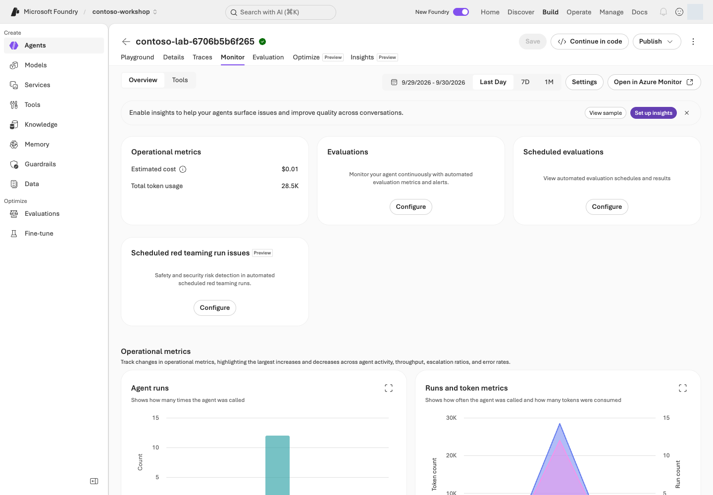

> **완성할 결과:** 코드 변경이 곧 운영 변경이 되지 않도록 검사·평가·승인·롤백을 연결합니다.

## 목표

코드뿐 아니라 **모델, agent, 도구, 지식, evaluator, dataset 버전**을 함께 관리합니다.

## 개념과 실습 지도

**경험할 기능:** 로컬 CI, 명시적 유료 검증 workflow, OIDC 인증, 릴리스/롤백과 비용 관리입니다.

**무엇이며 왜 중요한가요?** CI는 변경 때 검사를 반복하고, CD는 검증한 버전을 배포하는 절차입니다. 에이전트는 코드가 그대로여도 모델·문서·도구가 바뀌면 행동이 달라질 수 있어 릴리스 묶음 전체를 기록해야 합니다. OIDC는 CI가 장기 client secret 대신 실행에 연결된 identity로 인증하게 하지만, 그 identity에 어떤 권한을 주는지는 별도 관리 문제입니다.

**어떻게 사용하나요?** 먼저 로컬 계약 검사를 통과하고, 승인된 비운영 환경의 dev 검증을 실행합니다. 설정·데이터·기준을 동결한 뒤에만 release 경로를 선택합니다. 실패한 실행은 원본 그대로 남기고 이전 승인 버전으로 돌아갈 조건을 정하세요. 제작자의 결과를 새 학습자 환경의 통과 증거로 재사용하지 않습니다.

**어디서 실행하나요?** [validate.yml](https://github.com/junwoojeong100/microsoft-foundry-labs-v1.5/blob/docs/portal-walkthrough-20260930/.github/workflows/validate.yml)은 기본 검사, [azure-validation.yml](https://github.com/junwoojeong100/microsoft-foundry-labs-v1.5/blob/docs/portal-walkthrough-20260930/.github/workflows/azure-validation.yml)은 별도 승인 실행, [ci_live.py](../scripts/ci_live.py)는 대상·품질 경계 검사입니다. GitHub Actions 화면에서 실행 브랜치·입력·결과를 확인하고 Foundry 포털에서는 실제 배포 버전을 대조합니다.

## 준비

L08의 평가 게이트, L14의 hosted 프로젝트 또는 버전 관리되는 prompt agent, 비운영/운영 분리가 필요합니다. 실제 CI/CD의 OIDC federation·role assignment는 관리자 작업입니다.

## 실행

### 1. 릴리스 경로 만들기

```text
변경 제안
 → 로컬 계약 테스트
 → 비운영 배포
 → smoke test
 → 대표 데이터 평가 + 권한/안전 검사
 → 사람 승인
 → 운영 active version 전환
 → 모니터링
 → 실패 시 이전 승인 버전으로 복구
```

응답 파일이 비어 있지 않다는 조건은 smoke test일 뿐입니다. **에러 로그가 들어 있어도 파일은 비어 있지 않을 수 있습니다.** 실제 response 상태·출력 schema·기대 행동을 검사합니다.

### 2. 제공 키트의 로컬 검사를 재현하기

```bash
python -m unittest discover -s tests -v
python samples/workshop.py validate-data
python samples/evaluation_lab.py prepare --suite automated-v3 --split dev --input results/실제-dev-responses.jsonl
```

<div class="command-explanation" markdown="1">

**명령 해설**

| 순서·명령 | 세부 동작과 옵션 | 결과·비용/변경 |
| --- | --- | --- |
| 1. `unittest discover -s tests -v` | `tests/`의 테스트를 검색하고 각 테스트 이름과 결과를 출력합니다. | 로컬 코드 계약 검사. Azure 추론·배포 없음. |
| 2. `workshop.py validate-data` | 합성 데이터 구조·ID·기본 split을 검사합니다. | 로컬 검사이며 모델 답변의 정답률을 계산하는 명령이 아닙니다. |
| 3. `evaluation_lab.py prepare ...` | `--input`의 실제 v3 dev 30건을 읽어 지정 suite/split과 증거 계약을 확인합니다. | 로컬 검사. 파일이 없으면 dummy로 채우지 말고 먼저 승인된 실제 응답 수집 단계를 수행합니다. |

</div>

마지막 명령은 실제 v3 dev 응답 30건이 있을 때 실행합니다. dummy 응답이나 수동 판정값으로 자동 게이트를 대신하지 않습니다.

이 폴더의 `.github/workflows/validate.yml`은 문서와 로컬 테스트만 검사합니다. **Azure 배포·유료 추론을 자동 실행하지 않습니다.**

### 3. 조건부: Hosted CI/CD 연결하기

동봉 `.github/workflows/azure-validation.yml`은 **수동 dispatch / 명시적 재사용 호출 전용**입니다.
일반 push·PR에는 유료 Azure job이 없습니다. `acknowledge_cost=true`와
`contoso-validation` GitHub Environment 승인을 통과한 실행만 배포합니다.
기존 `.github/workflows/validate.yml`은 계속 자동 로컬 검사를 수행합니다.

관리자는 새 테스트 RG의 workload identity에 최소 역할을 부여하고,
federated credential의 subject를 **Actions가 실제 발행한 A의 environment-bound `sub`**로 제한합니다.
최근 형식은 owner/repository의 immutable ID를 이름 뒤에 `@ID`로 포함할 수 있습니다.
과거 `repo:owner/repo:environment:name` 문자열을 그대로 가정하지 않습니다.
audience는 `api://AzureADTokenExchange`입니다. client secret을 만들지 않습니다.
identity는 프로젝트 Foundry User, 필요한 배포/읽기 권한만 받으며 CI가 RBAC를 스스로 확대하지 않습니다.

관리자용 명령은 `python scripts/setup_oidc.py --branch 실제-feature-branch --subject "확인한-sub-claim" --live`입니다.
`--branch`는 허용할 GitHub 작업 브랜치, `--subject`는 실제 발행된 비밀이 아닌 OIDC `sub` claim 전체, `--live`는 실제 identity·federation·GitHub Environment 구성을 허용합니다. [setup_oidc.py](../scripts/setup_oidc.py)를 먼저 읽고 관리자에게 요청하세요. 단순 로그인 명령이 아니며 유료 호출 승인만으로 접근 권한 변경까지 승인되는 것은 아닙니다.
새 RG의 user-assigned identity, environment-bound federated credential,
새 GitHub Environment와 해당 branch policy를 함께 기록합니다.
기존 환경/identity가 있으면 충돌로 중단하며, tenant 전체 앱 권한을 부여하지 않습니다.
AADSTS700213이면 issuer·audience·subject를 로그의 비밀이 아닌 claims와 대조합니다.
`--repair-subject`는 이번 receipt의 FIC만 보정하며, GitHub 전체 OIDC 정책은 변경하지 않습니다.

Environment variables는 workflow `env` 목록의 client/tenant/subscription/project ID 및
모델·Search endpoint/index/KB입니다. 비밀이 아닌 구성값만 등록하고 인증 토큰·전체 `.env`·
원시 실행 결과를 artifact로 올리지 않습니다.

```bash
gh workflow run validate.yml --ref 승인된-작업브랜치 -f acknowledge_cost=true -f validation_phase=dev
# dev 통과 후 코드·데이터·기준을 동결한 다음에만:
gh workflow run validate.yml --ref 같은-동결브랜치 -f acknowledge_cost=true -f validation_phase=release
```

<div class="command-explanation" markdown="1">

**명령 해설 — 두 실행 사이에 dev 결과를 확인하고 설정을 동결합니다.**

| 순서·명령 | 세부 동작과 옵션 | 결과·비용/변경 |
| --- | --- | --- |
| 1. `gh workflow run ... validation_phase=dev` | `gh`는 GitHub CLI, `--ref`는 실행할 승인 브랜치입니다. `-f`는 workflow 입력 전달이며 `acknowledge_cost=true`는 유료 경로를 명시적으로 선택합니다. | 실제 Actions 실행을 요청합니다. 환경 승인 후 비운영 배포·dev 30건·judge 대조군 8건 등 비용이 발생하며 holdout을 호출하지 않습니다. |
| 2. `gh workflow run ... validation_phase=release` | 같은 동결 브랜치와 성공한 dev 증거로 최종 릴리스 검사를 요청합니다. 주석 줄은 실행 명령이 아닙니다. | 실제 평가 비용 가능. 원래 조건의 봉인 holdout 수집/보존 원본 평가이며, 준비가 다르면 holdout 전에 중단합니다. |

</div>

`validate.yml`은 기존 기본 브랜치에 있는 수동 진입점입니다. 승인한 작업 브랜치의
동일 파일이 로컬 검사를 마친 뒤 재사용 Azure workflow를 호출하므로,
새 workflow를 main에 먼저 merge할 필요가 없습니다.
GitHub 정책으로 수동 브랜치 실행이 막히면 차단으로 기록하며 main을 임의 merge하지 않습니다.
`scripts/ci_live.py`는 OIDC 주체와 RG/project 일치를 확인하고 Hosted를 배포하여
**290만원 초안·두 승인 역할·미주문**을 실제 tool result로 검사합니다.
dev 단계는 현재 v3의 30개 회귀와 8개 judge 대조군만 실행하며 holdout 질문을 모델에 전달하거나 호출하지 않습니다.
성공한 dev의 `contoso-ci-summary` artifact를 `validation/automated-v3/`에 받아 보존한 뒤
같은 runtime·모델·suite hash로 release를 실행합니다. 성공한 dev 증거가 없거나 코드가 달라지면
release는 holdout을 열기 전에 중단합니다.
release 단계는 봉인된 새 holdout을 최초 수집하거나 동일 환경/코드의 보존된 원본을 평가합니다.
사람 검토는 이 교육용 자동 게이트의 완료 조건이 아니며 안내 상태로만 기록합니다.
holdout은 환경 fingerprint·runtime hash·실제 모델이 현재 테스트 환경과 같아야 사용합니다.
다른 환경의 제작자 결과를 자신의 CI 품질 근거로 재사용할 수 없습니다.
calibration 실패 후에도 독립적인 holdout 증거를 수집할 수 있지만 **릴리스 게이트는 실패**입니다.
smoke 성공은 전체 holdout 품질 게이트와 별개입니다. `always()` 단계는 기록된 세션만 stop합니다.
원시 증거는 `results/`, 공유 가능한 v3 결과는 `validation/automated-v3/ci-dev.json`과
`ci-release.json` 및 합성 응답 파일로 분리합니다. 이전 v1 CI/실패는 [정리 전 Git 커밋](https://github.com/junwoojeong100/microsoft-foundry-labs-v1.5/tree/faa5ec26f15cfeb38f69de4036acedc3151c3df4/validation/history/v1)에 원본 그대로 보존합니다.

운영 진단용 `validation_phase=optimizer`는 고정된 이전 Responses 버전과 dev 데이터만 대상으로
동일한 OIDC 주체의 제한된 비교를 수행합니다. 새 holdout이나 품질 릴리스와 별개이며,
후보를 자동 적용·승격하지 않습니다.

### 4. 모델 업그레이드와 지식 변경 검사하기

| 변경 | 같이 재검사 |
| --- | --- |
| 모델 버전/auto-update | 응답 형식·도구 선택·지연·비용 |
| model router pool/subset | 허용 모델·품질·fallback·context |
| 지식 문서/index | 정확도·citation·삭제·권한·freshness |
| tool schema/endpoint | 호출 인수·인증·오류·중복 행동 |
| instructions/skills | regression·안전 경계 |
| evaluator/judge | 점수 의미·판정 일관성 |

모델 retirement 공지를 확인하고 충분한 기간에 대체 모델을 비교합니다. 같은 agent version이라도 router pool이나 외부 데이터가 변하면 행동이 달라질 수 있습니다.

### 5. 비용 계산표 만들기



**화면 따라 읽기:** **Build → Agents → 자신의 agent → Monitor**에서 먼저 기간을 선택하고 실행 수·토큰·예상 비용을 함께 봅니다. **Configure / Set up insights**는 새 관측·평가 구성을 시작할 수 있으므로 읽기 과제에서는 누르지 않습니다. 사진의 값은 선택된 기존 agent/기간의 관측치이지 RG 전체 청구액이나 이번 문서 개정의 비용이 아닙니다. 실제 청구는 Cost Management와 별도로 대조합니다.

개략적 추론비:

```text
입력 토큰 / 1,000,000 × 입력 단가
+ 출력 토큰 / 1,000,000 × 출력 단가
+ 평가 judge·검색·도구·음성/영상·로그·hosted runtime
+ 고정 용량·예약·스토리지 비용
```

가격은 실행 시 지역·통화·계약·모델별 가격표를 사용합니다. 캐시 할인·reasoning token·router·Batch 등의 과금 규칙도 확인합니다. 이 가이드는 “1인당 반드시 몇 달러”라는 고정 비용을 보장하지 않습니다.

### 6. 장애 훈련하기

도구 timeout, 429, 잘못된 연결, 단일 backend 장애를 비운영 환경에서 가정합니다. 중단·재시도·fallback·사람 인계가 어떻게 동작할지 기록합니다.

재시도는 제한된 횟수와 backoff/Retry-After를 사용하고, 비멱등 작업은 blindly retry하지 않습니다. 다지역 복구는 데이터를 허용되지 않은 지역으로 보내지 않아야 합니다. RTO/RPO를 조직 목표로 정하고 실제 훈련으로 측정합니다.

## 성공 기준

릴리스 버전 묶음·평가 기준·승인자·rollback 대상·비용 담당자·장애 대응 경로가 있습니다. CI 성공과 업무 품질 통과를 구분합니다.

## 막혔을 때

개발 환경에서는 되는데 CI에서 안 되면 OIDC subject, environment, identity 역할, 네트워크 접근, SDK/CLI 버전 차이를 확인합니다. 로그에 토큰이나 전체 환경 값을 출력하지 않습니다.

## 정리

불필요한 staging deployment, 지속 평가, 임시 federated credential과 권한을 담당자와 정리합니다.
