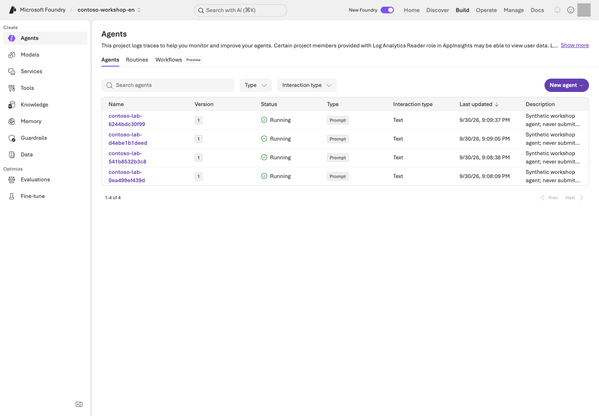

> **What you will build:** Package this repository's purchasing assistant with English synthetic data and invoke it locally and in Microsoft Azure.

<div class="lab-brief" markdown="1">

**Format:** Connect your L11 retrieval resources, invoke locally, deploy, then invoke the exact remote version.

**Start here:** Build the package in its dedicated Python environment. Follow the default Invocations path; skip the Optimizer adapter initially.

**What to check:** Verify the package, local response, remote version response, and stopped session separately. Local servers also incur costs when calling Microsoft Azure.

</div>

## Objectives

A Prompt Agent uses instructions and service tools; a **Hosted Agent runs code you manage yourself**.
The bundled implementation uses the **Invocations protocol** to exchange structured requests and evidence without changing their form.
Do not describe this as validation of the Responses, Voice, or Teams protocols.

## Concepts and lab map

**What you will try:** Move agent code from Codespaces to a Microsoft Foundry server.

**What is it, and why does it matter?** A Hosted Agent runs your code in Microsoft Foundry. Choose it when functions need a server rather than your open terminal. Code, data, settings, and the communication protocol must agree.

**How do you use it?** Build the package → call locally → deploy with approval → call the same remote version. Start with Invocations; the Responses adapter for Optimizer is optional.

**Where do you run it?** Execute and deploy in the terminal; inspect type and version in the portal. Find the [configuration](../../azure.yaml), [packaging](../../scripts/build_hosted.py), [server entry point](../../hosted/main.py), and [business code](../../samples/hosted_runtime.py).

## Prerequisites

This lab is based on the Search service/index and model from L11, Python **3.13**, azd **1.34.0**,
and `azure.ai.agents` **1.0.0-beta.10**.
Verify Hosted capabilities/regions. Use L01's scoped creation/role-assignment permissions; newly granting subscription-wide Owner is not the default prerequisite.

### Choose your starting path

| Current state | Steps to follow | What completion means |
| --- | --- | --- |
| No Microsoft Azure execution approval | Prepare the dedicated environment → step 1 packaging | Packaging only; server business calls and deployment not performed |
| Project, Search, and invocation approval ready | Steps 1 → 2 | Actual model/retrieval calls from a server inside Codespaces, not successful Microsoft Azure Hosted deployment |
| Deployment and role changes separately approved | Steps 1 → 2 → 3 → 4 → 5 | Inspect the exact remote version's answer and stopped session |

First locate **L01's `.env` and `results/azure-environment.json`, plus L11's `results/search.json`**, in this same lab folder. Stop if project address, language, or Search target differs. Never copy another learner's receipt or a screenshot's version number.

```bash
python3.13 -m venv .venv-live
source .venv-live/bin/activate
python -m pip install -r requirements-hosted.txt
python -m pip check
python scripts/check_sdk.py
```

<div class="command-explanation" markdown="1">

**Command walkthrough**

| # / Command | What it does and options | Result / cost or changes |
| --- | --- | --- |
| 1. `python3.13 -m venv .venv-live` | Creates a Python 3.13 virtual environment for Hosted. | Creates a local directory. Do not mix it with the advanced MAF environment. |
| 2. `source .venv-live/bin/activate` | Selects the new environment's Python for the current shell. | Changes only the current terminal; no Microsoft Azure resources are touched. |
| 3. `pip install -r requirements-hosted.txt` | Installs the pinned dependencies for the Hosted server and SDK. | Package downloads and local installation. No model inference. |
| 4. `pip check` | Checks for conflicts between the installed packages' dependency requirements. | A read-only check. Do not proceed if it reports errors. |
| 5. `check_sdk.py` | Locally checks the SDK classes and call contracts used by the samples. | An import/API contract check, not evidence of remote deployment or model quality. |

</div>

The `.venv-advanced` environment for the MAF lab is separate. Do not simply merge incompatible `azure-ai-projects` constraints. Keep `FOUNDRY_LAB_LANGUAGE=en` selected in every terminal and use only this English checkout's configuration and receipts.

<details class="environment-option" markdown="1">
<summary>Only when using Windows PowerShell on your PC</summary>

Use L01's `py -3.13` approach to create `.venv-live`, then execute with `.venv-live\Scripts\python.exe`. Use `curl.exe` for the `curl` commands below. Do not paste Bash's `source` command into PowerShell. See [L00 command reading](#l00) for environment-variable syntax. Do not make these substitutions in Codespaces.

</details>

<a id="l12-azd"></a>

**If azd is missing in Codespaces,** use the approved **Linux installation path** in the [official Microsoft Azure Developer CLI installation guide](https://learn.microsoft.com/azure/developer/azure-developer-cli/install-azd), then open a new terminal. Microsoft Azure CLI's `az` and Developer CLI's `azd` are different tools. Preparing azd does not require a Copilot skill or a Hosted deployment. Use another OS's instructions only for the PC alternative.

azd and Microsoft Azure CLI have separate authentication. Check versions/extensions and sign-in first. Use the Bash commands below unchanged in Codespaces.

```bash
AZURE_DEV_USER_AGENT=microsoft_foundry_skill azd version
AZURE_DEV_USER_AGENT=microsoft_foundry_skill azd extension list
AZURE_DEV_USER_AGENT=microsoft_foundry_skill azd auth login --check-status
```

<div class="command-explanation" markdown="1">

**Command walkthrough**

| Order and command | What it does | Result, cost, or change |
| --- | --- | --- |
| 1. `azd version` | Checks the installed CLI version. | Local inspection, no automatic upgrade. |
| 2. `azd extension list` | Checks the agent extension/version. | Listing only; no Copilot skill is required. |
| 3. `auth login --check-status` | Checks azd user sign-in. | No deployment/model call; separate from Microsoft Azure CLI sign-in. |

</div>

Run only the missing prerequisite below. Do not reinstall a compatible existing environment.

```bash
AZURE_DEV_USER_AGENT=microsoft_foundry_skill azd extension install azure.ai.agents --version 1.0.0-beta.10
AZURE_DEV_USER_AGENT=microsoft_foundry_skill azd auth login
```

<div class="command-explanation" markdown="1">

**Command walkthrough — choose only needed setup.**

| Order and command | What it does | Result, cost, or change |
| --- | --- | --- |
| 1. `extension install` | Installs the kit's agent CLI contract. | Local download/install; do not force-downgrade/update existing extensions. |
| 2. `auth login` | Authenticates your own account with azd. | Complete authentication directly; do not store secrets in files/chat. |

</div>

## Steps

<a id="l14-1-build-the-package-before-making-azure-calls"></a>

### 1. Build the package before making Microsoft Azure calls

```bash
python scripts/build_hosted.py
```

<div class="command-explanation" markdown="1">

**Command walkthrough**

| # / Command | What it does and options | Result / cost or changes |
| --- | --- | --- |
| 1. `build_hosted.py` | Generates a deployment directory, ZIP, and file-hash manifest from checked-in runtime code and the selected English policies, inventory, and instructions. Binds `en` in the generated `lab-profile.json`. | Changes only this English checkout's local `.build/` artifacts. No Microsoft Azure deployment. The archive does not include `.env` or evaluation reference answers. |

</div>

- **Created:** `.build/contoso/` and `.build/contoso-code.zip`. The Responses profile for Optimizer is generated separately in `.build/contoso-responses/`; the default Invocations and Optimizer Responses builds are separate, and each needs its own execution evidence.
- **Included:** purchasing policies, inventory, instructions, runtime code, profile metadata, and pinned dependencies.
- **Excluded:** `.env`, authentication material, evaluation reference answers, existing results, and personal environment files.
- **Check:** `language=en` in `lab-profile.json`, and the language, per-file hashes, and runtime contract in `package-manifest.json`. The package keeps its bound language at runtime and rejects a conflicting profile; a browser-language change cannot switch a deployed package's corpus. Rebuild from the selected English profile before deployment rather than reusing a Korean ZIP. There is no need to clone an external sample repository.

### 2. Run and invoke locally

In the server terminal, run the following bundled helper. It passes only approved, non-secret values
from the L01/L11 `.env` and `results/search.json` to the child process.

```bash
python scripts/run_hosted_local.py
```

<div class="command-explanation" markdown="1">

**Command walkthrough**

| # / Command | What it does and options | Result / cost or changes |
| --- | --- | --- |
| 1. `run_hosted_local.py` | Starts the default Invocations server on loopback port 8088 and passes safe environment settings to the child process. | Keep the server terminal open. Even when execution is local, real requests can use Microsoft Azure models and search. Stop it with Ctrl+C when finished. |

</div>

In another terminal, reselect L01's `FOUNDRY_LAB_LANGUAGE=en` and the Hosted Python environment in the same English checkout:

```bash
curl --fail http://127.0.0.1:8088/readiness
python samples/hosted_client.py invoke --local
python samples/hosted_client.py invoke --local --live
```

<div class="command-explanation" markdown="1">

**Command walkthrough** — Run these in a second terminal.

| # / Command | What it does and options | Result / cost or changes |
| --- | --- | --- |
| 1. `curl --fail .../readiness` | Reads the local server's readiness endpoint. `--fail` treats HTTP errors as failures. | Checks server connectivity; it is not a purchasing question or model call. |
| 2. `invoke --local` | Selects the local target but prints only a plan because `--live` is absent. | No business request to the server or Microsoft Azure inference. `--local` alone does not authorize a real invocation. |
| 3. `invoke --local --live` | Sends a real synthetic purchasing request to the local server. `--live` authorizes the cost of the model/Search calls behind the server. | Inspect the response JSONL and the function, citation, and contract checks. Do not label local results as a successful Microsoft Azure Hosted deployment. |

</div>

**The local server also uses real Microsoft Azure models and search, so invocations incur charges.**
The default binding is loopback; do not expose this unauthenticated development server externally.
Each request is split into **at most two tool rounds → a separate tool-free, evidence-based answer → source correspondence check**.
Each tool-round output and the answer remain limited to **2048 tokens**; the source check remains limited to 512 tokens.
The model executes at most **two tool rounds, one answer, and one attribution request**. The full server budget is **8 tool records, 12 requests, and 300 seconds**, with zero automatic SDK retries. Local/remote HTTP client timeout is **310 seconds**; a longer wait does not authorize more requests or prove success.

<details class="optional-path" markdown="1">
<summary>Implementation reference: separating retrieval, tools, and grounded answers</summary>

The current engine performs question-specific search and retrieves the 13 sections of the small synthetic policy corpus **before** running the model.
It does not wait for the model to select a search function. Internally, the answer is `answer`/`citation_ids` JSON;
only the sections the model selects from the actual returned results are rendered as citations. Missing search results or citations are errors, not successes.
In `tool_calls`, `execution=server_required` records a real server-side search; it does not pretend the model called it.
The current runtime requires explicit permission for inventory calls and rechecks every attempted business tool. Missing or invalid draft quantities do not authorize an unrequested lookup. Read-only calls are still tool execution.
Both packages load `agent-v2.txt`. Its answer procedure is not evidence of a new Microsoft Azure deployment or quality pass; compare your package hash with the actual invoked version.

Use the actual service-issued deployment version, not the instruction number. When a session is already bound to a version, invoke it with `--session-id` only; combining that flag with `--version` is rejected by azd.

The tool-execution stage is skipped when no business tools are authorized. Otherwise it does not force an answer JSON format; a second bounded round lets the model request a draft after obtaining stock information.
The answer-only stage uses a fresh input built from the user's question, actual retrieved documents, function definitions, and recorded tool results/errors—not pending function calls or planning text. It has no tools available and must produce exactly one strict `answer`/`citation_ids` JSON object.
Do not publish a statement of intent to call a tool as an answer or as execution evidence.

Draft-tool arguments must be tied to a SKU explicitly provided by the user and one unambiguous integer quantity.
Even if the model fills in a missing quantity with 1 or reduces 11 items to 10, the code rejects the call before execution.
If the same SKU/quantity draft has already succeeded in this turn, a repeated request is rejected before execution with `duplicate_tool_request` and `duplicate_of` pointing to the original call ID. Preserve the original successful result and the rejection separately; do not count the rejection as a second draft or hide it as a successful repeat.
The answer stage also receives the actual function definitions so that it does not confuse the tool's 1–10 input constraint with company policy.
The final source-check stage selects evidence using only the actual retrieved material and the written answer,
and the actual selections from both models are displayed together. Required draft/approval/authority evidence must be selected by the model; missing selections are not filled in automatically. The original answer and the response IDs for source selection are preserved separately.

</details>

**Three distinct checks:** `/readiness` verifies server connectivity; `invoke --local` prints a plan; `invoke --local --live` executes the business request. Inspect original `tool_calls`, citations, and `order_submitted=false` before proceeding to remote deployment. Keep the server terminal open; do not start a second server or recreate the environment in the client terminal.

### 3. Deploy to the project you created



**Read the screen:** Use **Type** to distinguish Hosted/Prompt and **Version** to identify the code/definition version. Open the name to inspect deployment settings and protocol, and use your own version from CLI `show` rather than copying the image's numbers. Check individual session compute, costs, and business responses separately from the list's **Running** status.

Bind your L01 receipt and L11 Search settings to azd. Verify deployment/runtime-role scope before execution.

```bash
python scripts/configure_hosted.py
AZURE_DEV_USER_AGENT=microsoft_foundry_skill azd deploy contoso-purchasing --no-prompt
AZURE_DEV_USER_AGENT=microsoft_foundry_skill azd ai agent show contoso-purchasing --output json
python scripts/runtime_roles.py --agent contoso-purchasing --live
```

<div class="command-explanation" markdown="1">

**Command walkthrough** — Use your owned project and permitted access/cost scope.

| # / Command | What it does and options | Result / cost or changes |
| --- | --- | --- |
| 1. `configure_hosted.py` | Binds your receipt's project/region/model/Search settings to azd. | Local binding; stops if `.env` and receipt differ. |
| 2. `azd deploy contoso-purchasing --no-prompt` | Performs a real deployment of only the specified service in `azure.yaml`. `--no-prompt` skips interactive confirmation; it is not a dry run. | Remote deployment, a new immutable version, and possible charges. This CLI does not require `--live`. |
| 3. `azd ai agent show ... --output json` | Reads deployed agent metadata as structured JSON. | Record the numeric version and target project. No business request has been sent yet. |
| 4. `runtime_roles.py --agent ... --live` | Grants your runtime identity scoped project, Search-read, and model-invocation access. | Actual role changes; runtime identity differs from your user and receives no subscription-wide roles. |

</div>

`configure_hosted.py` prepares the binding including **`AZURE_LOCATION`**. Keep English profile/`.azure/` isolated; do not publish full `azd env get-values` output. `azure.yaml` uses **code deployment** without requiring Docker/ACR. L01 already created resources, so do not additionally run `azd provision` here. Each deployment creates an immutable version.

### 4. Invoke the exact remote version

```bash
python samples/hosted_client.py invoke --version ACTUAL_NUMERIC_VERSION --live
```

<div class="command-explanation" markdown="1">

**Command walkthrough**

| # / Command | What it does and options | Result / cost or changes |
| --- | --- | --- |
| 1. `invoke --version ... --live` | Creates a new session for the exact numeric version of the default `contoso-purchasing` Invocations service and sends one English synthetic question. Replace `ACTUAL_NUMERIC_VERSION` with your English deployment's version number. The projects in azd and `.env` must match. | Real Hosted, model, and Search charges, plus response evidence. Confirms that compute for the same session is stopped in `finally`. Does not delete the agent. |

</div>

Use the actual version from `show`. Invoke it in a new version-bound session and
**stop only its compute** in `finally`. The response, internal model response IDs, tool call IDs, citations, and trace ID are returned.
A mismatch between the local package contract and remote contract causes failure.
If there is no trace ID, leave it recorded as not collected rather than guessing.

Deployment and session management use azd. The bundled Invocations client sends
**an Entra-authenticated HTTP JSON request to the endpoint returned by the service** and reads its response body.
Inspect those response fields rather than parsing CLI display output.

### 5. Verify the basic tools in action

The question is “Check the policies and stock for 2 NB-14 laptops and create only a purchase request draft.”
Inspect the arguments and results for `search_policies`, `get_stock`, and `prepare_purchase_request`.
The total must be **KRW 2,900,000**, with both approval roles and `order_submitted=false`.
When connecting a separate Toolbox, retain L07's authentication principal and one-time approval policy.

<details class="implementation-detail" markdown="1">
<summary>Implementation reference: the Hosted request and error handler — read only</summary>

#### Hosted version in the portal and the actual HTTP handler

The portal shows the deployed Hosted type/version; Python in the container handles `/invocations`. The core handler in `hosted/main.py` is:

```python
@app.invoke_handler
async def handle(request: Request):
    raw = await request.body()
    if len(raw) > 32_000:
        return JSONResponse({"error": "request_too_large"}, status_code=413)
    try:
        payload = validate_request(json.loads(raw))
    except (ValueError, UnicodeDecodeError) as exc:
        return JSONResponse({"error": "invalid_request", "message": str(exc)}, status_code=400)
    async with gate:
        try:
            result = await asyncio.to_thread(invoke, payload)
            return JSONResponse(result)
        except (AzureError, OpenAIError, ValueError, RuntimeError, OSError) as exc:
            evidence = Evidence("hosted-failure")
            evidence.failure(exc)
            return JSONResponse(
                {"error": type(exc).__name__, "run_id": evidence.run_id, "status": "failed"},
                status_code=502,
            )
```

| Portal/execution step | Actual code |
| --- | --- |
| Hosted service receives `POST /invocations` | `@app.invoke_handler` |
| Validate request JSON and size | `validate_request(...)` and the 32,000-byte limit |
| Limit concurrent invocations | `async with gate` |
| Model, retrieval, and function flow | `invoke(payload)` → `samples/hosted_runtime.py` |
| Connect to the portal agent version | Compare the exact numeric version in the invocation/receipt |
| Handle failure | Record evidence and return an actual 400/413/502 failure |

The portal does not edit the handler; it shows the deployed type/version of the container that includes it. `hosted_runtime.py` is the business flow, while `hosted/main.py` is the HTTP entry point. Local execution may still call real Microsoft Azure services.

</details>

## Success criteria

- You separately verified packaging, server startup, the local business result, deployment, and the remote business result for the same version.
- Hashes, tools, and citations are connected.
- You did not label a successful deployment alone as a quality pass.

## Troubleshooting

| Symptom | Check first |
| --- | --- |
| Health failure | The entry point and dependencies |
| 502 | The preserved upstream error |
| 403 | The runtime identity's model/Search roles |
| 424 cold start | Inspect logs and retry only a bounded number of times |
| Multiple JSON objects or `incomplete` output | The tool/answer boundary and actual results. Do not increase the 2048-token limit or weaken citation checks. |
| A remote timeout | Existing evidence and the recorded session state. A timeout does not prove that the server did nothing; take any further action only after separate approval. |

Do not turn an error message into a normal answer with HTTP 200.

## Cleanup

Stop the local server with Ctrl+C in the terminal where you started it. For interrupted runs,
use `python scripts/stop_sessions.py` to stop **only recorded sessions**.
The agent/version/session files and Microsoft Azure resources remain. Record the remaining storage, log, and Search costs in L19.

Hosted's `/app` is read-only. Write remote raw evidence only to the session's `$HOME/.contoso/evidence`,
not to the code directory. Do not include it in the package.

<div class="lab-handoff" markdown="1">

**Keep:** Package contract/hash, local/remote results or not-run labels, remote numeric version, and session-stop evidence. Stop the local server with Ctrl+C too.

**Continue:** [L13](#l15) if you select collaboration patterns; otherwise [L19](#l12). Subsequent commands use the Python environment named by each module.

</div>
