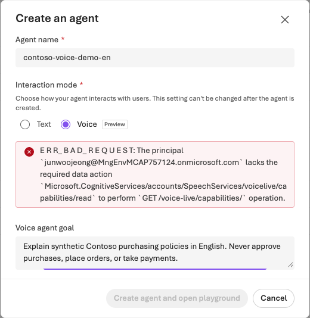

> **What you will build:** A voice agent that speaks brief purchasing guidance, with interruption, silence, and session termination verified.

## Objectives

**Speech STT/TTS, real-time Voice Live, and a voice Prompt Agent are not interchangeable terms.** Distinguish Speech's GA capabilities from the Voice Agent Preview experience.

## Concepts and lab map

**What you will try:** Speech recognition, speech synthesis, real-time turn detection, user interruption, and session termination.

**What is it, and why does it matter?** STT converts sound into text, TTS converts text into sound, and a Voice Agent also manages conversation state and response timing between them. Even an answer that is correct in text can mishear an amount or miss a corrected quantity in voice. Usability requires checking not just content accuracy, but when the agent listens, speaks, and stops.

**How do you use it?** Start with a short synthetic sentence, then test quantity recognition → confirmation question → interruption → quantity correction → termination. The user grants microphone permission directly in the browser. End the session before changing settings, and compare the resulting transcripts and latency.

**Where do you run it?** Voice input takes place in a browser with a real microphone and speakers. This guide's headless portal captures show where settings are located; they are not evidence of a successful voice conversation. The supplied instructions use this chapter's synthetic scenario and do not include real customer calls or custom voice training.

## Prerequisites

You need voice Preview access for a supported region/project, a compatible voice model, a microphone/speakers, and an approved browser. Check usage/session costs and keep tests short.

## Steps

### 1. Create a Voice Agent

Select **Build → Agents → New agent → Build an agent → Interaction mode: Voice**. The creation dialog states that interaction mode cannot be changed after creation, so use a separate voice lab agent. Record the current UI defaults for model, language, voice, and turn detection.



**Read the screen:** **Agent name** must be a synthetic name distinct from the other labs; **Interaction mode** is **Voice Preview**. The English capture's form was closed with **Cancel**, not **Create agent and open playground**. No voice-session success is claimed from that observation. Consult the [English capture log](../../content/portal-screenshots.en.json) for exact capture actions. A Preview selection screen does not prove agent creation, microphone access, or a successful paid voice conversation.

Learners proceeding with the lab should enter a **Voice agent goal** such as “Provide brief guidance in English on synthetic Contoso purchasing policies; do not place real orders or perform approvals.” After creating the agent in an approved environment, review the Playground's instructions, model, voice, and English-language settings; do not use automatically filled settings without checking them.

Instructions:

```text
You are a Contoso purchasing guidance lab assistant.
Speak briefly in English and confirm one thing at a time.
Reconfirm amounts and quantities.
Do not place real orders, grant approvals, or make payments.
If a tool fails, report the failure and do not claim success.
Do not read long tables or full identification numbers aloud.
```

Check whether connecting L05's English knowledge from `data/en/policies/` is supported. Do not answer as though you remember knowledge that is not available.

### 2. Start a short conversation

After saving, select **Start session** and, if needed, personally allow microphone access in the browser. Say “I'd like to buy two laptops.”

### 3. Check conversation quality

Run the sequence below once in one session. The one-second pause is a **controlled input condition**, not a universal voice-application acceptance threshold.

| Input/observation | How to judge it | Next action on failure |
| --- | --- | --- |
| Say “two laptops,” then read the transcript | Quantity 2 is recognized and confirmed | If the transcript is wrong, check microphone/recognition language. If text is right but the answer is wrong, inspect instructions/conversation state |
| “I'd like…” → one-second silence → “…two laptops” | Record whether the intended single utterance was split | End the session, then compare one turn-detection setting. Service defaults are not universal quality criteria |
| Interrupt with “Not two—one laptop, please” | Previous speech stops; the next answer confirms quantity 1 | Compare interruption timing and transcript; distinguish missed recognition from playback of a stale response |
| State after `End session` | Ended status, stopped audio, and no microphone use by that session | Confirm session state rather than relying on a closed browser tab |

For end-of-utterance → first-audio latency, use the displayed measurement or label your own timing **manual measurement**. A session without tools does not test tool-failure handling. If a tool is connected, separately approve a failure input and inspect both execution evidence and the failure response. End the session before changing settings; record identical input, changed setting, and observed difference.

### 4. Separate Foundry Tools by purpose

| Capability | Short additional exercise |
| --- | --- |
| Speech-to-text | Recognize the same synthetic sentence 3 times and check quantity/amount errors |
| Text-to-speech | Check natural English pronunciation of “KRW 1,450,000” |
| Language / PII | Compare detection and masking of the synthetic `lab.user@example.invalid` |
| Language / classification and summarization | Compare 3 labels: purchasing, inventory, and policy inquiries |
| Translator | Translate the same English policy sentence into another supported language and back; check that amounts and obligations are preserved |

Translator's `2026-06-06` GA request/response contract may differ from v3.0. Do not casually mix an existing `text` payload example with the new version; check that version's contract, including fields such as `inputs`/`value`.

### 5. Conditional: Avatar and real-time transport

Supported browser/avatar settings or the Hosted Agent real-time WebSocket path are separate experiments. Telephone connections, real customer calls, and custom voice training are not part of the core course and require separate consent, policies, and authorization.

## Success criteria

Record the transcript, actual quantity change 2→1, interruption handling, latency measurement method, and ended state. Leave unobserved items unverified; “it made a sound” is not sufficient.

## Troubleshooting

If Voice mode is absent, first check Preview access and supported regions. Check the microphone, model, voice language, and browser output device. Do not create a text agent instead and record it as a voice success.

## Cleanup

Select **End session** and verify that no active session remains. Define retention and access scope for audio and transcripts.
