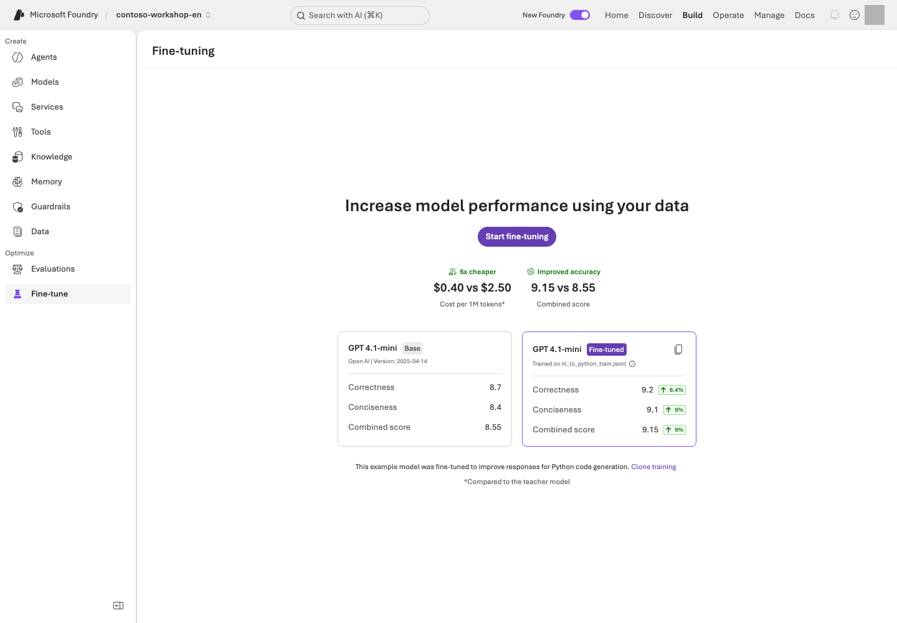

> **What you will build:** Connect the observed v1/v2 differences to the right improvement method, distinguishing instructions from model training.

## Objectives

Start with **RAG for new facts, instructions for procedure/omissions, and fine-tuning for repeated learned behavior**.
The current improved instructions are [v2](../../data/en/prompts/agent-v2.txt). Do not create v3/v4 files or growing evaluation numbers for each edit.

## Concepts and lab map

**What you will try:** Instruction improvements, controlled comparison, optional Agent Optimizer, and SFT data preparation.

**What is it, and why does it matter?** Instructions change how the model uses supplied information. Fine-tuning learns behavior from examples.
Neither establishes a missing contract, exchange rate, or permission.

**How do you use it?** Read the originals from L08's single comparison and classify the cause.
Keep ties and regressions; repeatedly searching for a higher score is not the exercise.

**Where do you run it?** Use the [instruction comparison](../../samples/instruction_lab.py), [optional Optimizer code](../../samples/optimizer_lab.py),
and [training-data preparation](../../samples/prepare_tuning.py). Use Optimize/Fine-tune in the portal to understand inputs, limits, and outcomes.

## Prerequisites

Use L08's v1/v2 originals and fixed checklist. Do not call the model again if that comparison already exists.
Optimizer and real training jobs require separate approval, supported models, and permissions; they are not core-course completion requirements.

## Steps

### 1. Select the right improvement

| Observed problem | First approach |
| --- | --- |
| Missing new policy facts | Check retrieval, documents, currency, and access scope |
| Omitted subquestions or evidence | V2's question separation, claim-specific sources, and final completeness check |
| Invalid arguments or excessive actions | Function schemas and server-side intent/quantity validation |
| Repeated format/style problems | Consider fine-tuning after preparing sufficient examples |

Do not weaken v1 or put question-specific answers into v2. Both receive the same context, model, questions, and criteria.

### 2. Optional: Understand Agent Optimizer

Agent Optimizer is Limited preview; verify availability and supported models separately.
L08's one comparison is enough for the core exercise. Repeated jobs and automatic candidate promotion are unnecessary.

```bash
python samples/optimizer_lab.py --agent ACTUAL_RESPONSES_AGENT --version ACTUAL_NUMERIC_VERSION --optimizer-deployment APPROVED_OPTIMIZER_DEPLOYMENT --prompt-file data/en/prompts/agent-v2.txt
```

<div class="command-explanation" markdown="1">

**Command walkthrough**

| Order and command | Details and options | Result, cost, or change |
| --- | --- | --- |
| 1. `optimizer_lab.py` | Inspect the plan for your actual Responses agent/version, reflection deployment, and current v2 instructions. Replace the placeholders with your own verified values. | Without `--live`, no Azure request occurs. Old deployment numbers or evaluations do not validate the edited v2. |

</div>

Only after separate live approval, align the deployed instructions, input data, and evaluators.
The advanced runner retains source-freeze checks, dev-only input, at most two candidates/one stall, time limits, cancellation, and owned-session cleanup.
Do not bypass an old freeze that differs from current code or reuse a consumed exam.
Service `succeeded` is not proof of improvement. Inspect missing, errored, and failed rows and retain a no-improvement outcome.
Preparing this advanced path is not a prerequisite for the v1/v2 learning comparison.

### 3. Learn the local SFT format

```bash
python samples/prepare_tuning.py
```

<div class="command-explanation" markdown="1">

**Command walkthrough**

| Order and command | Details and options | Result, cost, or change |
| --- | --- | --- |
| 1. `prepare_tuning.py` | Prepare training/validation JSONL from checked-in synthetic examples. | Local files only; no Azure upload, training, or deployment. |

</div>

These small seeds teach the format; they do not guarantee useful training results.
Never copy evaluation answer keys or holdout cases into training data.

### 4. Select a training approach

| Method | Data | Main concern |
| --- | --- | --- |
| SFT | Inputs and desired outputs | Avoid imitating incorrect answers |
| DPO | Preferred and rejected responses | Consistent preferences |
| RFT | Problems and a verifiable grader | Reward hacking and grader errors |



Real training requires separate approval after reviewing model/region support, data handling, and costs.
Completing a training job, deploying a model, and improving evaluation results are separate outcomes. Do not default to automatic deployment or promotion.

## Success criteria

Explain the intended v2 improvements and actual answer differences, then choose retrieval, instructions, tool constraints, or training appropriately.
Preparing files does not establish completed training or a score increase.
The [current comparison](../../validation/current/report.json) actually measured both languages, with tied v1/v2 scores. No Optimizer or holdout was newly executed. The [previous Optimizer original](https://github.com/junwoojeong100/microsoft-foundry-labs-v1.5/blob/6fddd4642be0d0ac9dfee9b9b51e7b00b5cf1cde/validation/english/automated-v5/optimizer.json) preserves its actual execution and failed outcome; it is not relabeled as the current comparison.

## Troubleshooting

Distinguish model support, Preview access, deployed instructions, dev inputs, and evaluator failures.
When prerequisites are absent, record not executed and finish the learning objective with L08's single comparison.

## Cleanup

Local data preparation creates no cloud job. If you separately approved a job, confirm that exact owned job and its sessions have stopped.
Do not delete resources or change access without separate approval.
