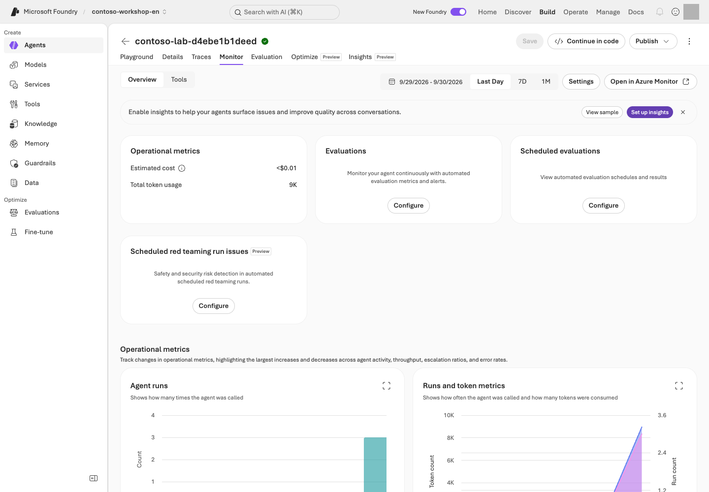

> **What you will build:** A CI interpretation record, agent release manifest, rollback decision table, and model/cost checklist. Design these without deploying, and distinguish plans from execution evidence.

<div class="lab-brief" markdown="1">

**Format:** Advanced elective · local CI failure→repair and release/recovery design by default.

**Start here:** Choose a path below, then reproduce three failures in step 2's synthetic candidate-selection exercise. No actual deployment or publishing is needed to start.

**What to check:** Keep a CI interpretation, release manifest, rollback decision, and cost owner. This chapter does not require a Hosted deployment.

</div>

## Objectives

**Passing source checks, deploying to Azure, and being ready for users are different decisions.** Separate them and decide which failures should block promotion or trigger a return to an approved version.

**What does this add?** Practice blocking a bad promotion and choosing a recovery target when you want delivery/operations automation. This is a capability choice, not a participant-persona split. Neither documentation builds nor Teams publishing is a core completion requirement.

## Concepts and lab map

**What you will try:** Prevent a failing candidate from shipping and plan recovery.

**What is it, and why does it matter?** CI automatically checks changes; CD deploys reviewed changes. Rollback returns to a previously approved version. Completed execution is not a quality pass.

**How do you use it?** Reproduce three failures and repair the candidate-selection conditions. Use existing results to write a release manifest and rollback decision. No new Hosted deployment is required.

**Where do you run it?** Work on your PC. Read **`.github/workflows/` in your supplied sources** to distinguish [local checks](https://github.com/junwoojeong100/microsoft-foundry-labs-v1.5/blob/6fddd4642be0d0ac9dfee9b9b51e7b00b5cf1cde/.github/workflows/validate.yml) from [separately approved execution](https://github.com/junwoojeong100/microsoft-foundry-labs-v1.5/blob/6fddd4642be0d0ac9dfee9b9b51e7b00b5cf1cde/.github/workflows/azure-validation.yml).

## Prerequisites

Use L01's environment and repository sources. **Search, Hosted, and Optimizer are not prerequisites for the default exercise.** Use L06/L12 results for a real manifest; without them, complete it as a design.

### Choose your starting path

| Goal | Sequence | What completion means |
| --- | --- | --- |
| Understand how CI blocks bad promotion | Step 1 workflow → step 2's three failures → repair function → five passes with unchanged tests | Local code exercise |
| Prepare for operations | Above → step 3 manifest → step 4 recovery decision → step 5 owners | Release design; deployment/publishing not performed |
| Approved live publishing | Above plus every permission, protocol, and test-scope condition in 4-1 | Record only actual version changes, publishing, and invocations separately |

Edit `practice/delivery/exercise.py`, not `test_exercise.py` beside it. If the folder already exists, choose another `--output` path and update the test path to match; do not delete or overwrite the existing exercise.

## Steps

### 1. Read what runs automatically

Open `validate.yml` in an editor and locate `on`, `jobs`, `needs`, and `if`. Compare the table with the actual YAML.

| What to inspect | How to judge it | Next action on failure |
| --- | --- | --- |
| `push` / `pull_request` → `offline`, `sdk` | Document/data/code and SDK contract checks, not Azure deployment | Read the failed job's **first error and command**, not just its final “failed” message |
| `azure` with `needs: [offline, sdk]` | Both prerequisite checks must pass before the paid path can run | Do not call a failed/skipped job a successful deployment |
| `workflow_dispatch`, `acknowledge_cost`, `repository_id` | Explicit opt-in and this repository's identity; forks do not inherit access | Keep the default false; do not remove repository or approval conditions for the exercise |
| `environment`, `id-token: write` in `azure-validation.yml` | OIDC authenticates a workflow identity; Azure roles and environment approval remain separate | Escalate branch/environment/tenant/project mismatches; do not substitute a long-lived secret |

If GitHub is available, open **Actions → run → job → failed step** and locate the same items. Otherwise inspect sources and record “workflow execution unverified.” The default exercise requires neither a new push nor a paid workflow dispatch.

<details class="optional-path" markdown="1">
<summary>Reference: repository checks and documentation build — the main exercise is step 2 below</summary>

The repository-wide checks below are a reference. Start with the **failure→repair exercise** to experience what CI blocks without deliberately breaking existing business code or evaluation criteria.

The first line is needed only if documentation dependencies are missing. L01's base dependencies must already be installed.

```bash
python -m pip install -r requirements-docs.txt
python scripts/build_guide.py
FOUNDRY_LAB_LANGUAGE=ko python -m unittest discover -s tests -q
python scripts/check_guide.py
```

<div class="command-explanation" markdown="1">

**Command walkthrough**

| Order and command | Details and options | Result, cost, or change |
| --- | --- | --- |
| 1. `pip install -r requirements-docs.txt` | Prepare the declared Markdown dependency in the current virtual environment; skip if present. | Package download/local installation; no Azure calls. |
| 2. `build_guide.py` | Generate both HTML/Markdown editions from sources and metadata. | Local file changes; do not edit generated output manually. |
| 3. `FOUNDRY_LAB_LANGUAGE=ko ... unittest ... -q` | Run shared Korean-baseline tests and explicit English checks. | Local contracts, not Azure or model quality. |
| 4. `check_guide.py` | Check 20 modules and five reference sections, command explanations, links, and image files. | Save documentation checks to `results/documentation/`. |

</div>

Record success as **code/document checks passed** only. For import errors, inspect the virtual environment/requirements; for generated drift, inspect `docs/` and `content/`; for business assertions, inspect the relevant function/policy contract. Do not weaken assertions or evaluation criteria.

For PDF/ZIP delivery, continue with the README build path. Artifacts under `downloads/` and the root web entry points are **separate from agent deployment artifacts**. Documentation generation supports this chapter; it is not CD evidence.

</details>

### 2. Fix it: completion alone must not promote a candidate

<div class="practice-block" markdown="1">

**Try it:** This pure function returns fictional version names. It changes no actual endpoint or Active version.

```bash
python samples/prepare_practice.py delivery --output practice/delivery
python -m unittest discover -s practice/delivery -p "test_exercise.py" -v
```

<div class="command-explanation" markdown="1">

**Command walkthrough**

| Order and command | Details and options | Result, cost, or change |
| --- | --- | --- |
| 1. `prepare_practice.py delivery` | Copies a flawed function, tests, and an optional workflow template into a new folder. | Local files only; no GitHub push or Azure deployment. |
| 2. `unittest discover` | Separates a good candidate, failed run, quality failure, critical failure, and missing row. | Initially **three of five tests fail intentionally**. Do not hide these failures. |

</div>

`practice/delivery/exercise.py` chooses `candidate-2` from `status=completed` alone. A completed run with a quality failure, safety failure, or missing row must keep `approved-1`.

**Change one thing:** Make candidate selection an AND of four conditions: completed status, `quality_passed is True`, zero critical failures, and zero missing rows. Change neither tests nor the original release gates. Rerun the same check and require five passes.

<details markdown="1">
<summary>Example repair — a local decision exercise, not the complete production gate</summary>

<!-- solution:delivery -->
```python
def choose_version(previous: str, candidate: str, checks: dict) -> str:
    if (
        checks["status"] == "completed"
        and checks["quality_passed"] is True
        and checks["critical_failures"] == 0
        and checks["missing_rows"] == 0
    ):
        return candidate
    return previous
```

</details>

**Explain the result:** Describe the incorrect promotion prevented by each of the three failed tests. Complete a `previous version / candidate / failure evidence / version to keep` table. This function performs neither deployment nor state migration, so do not call it completed remote rollback.

**Optional: observe the same failure→repair in GitHub.** Use only a new branch in an approved personal training repository. Copy the supplied `workflow.yml` to `.github/workflows/contoso-practice.yml` and include the code/tests under `practice/delivery`. Run **Actions → Contoso local delivery practice → Run workflow** on the flawed commit, then on a commit changing only `exercise.py`; expect failure then success. The template has manual dispatch, read-only permissions, and Python checks—no Azure sign-in, secrets, or deployment. Do not replace this repository's existing `validate.yml` or enable `acknowledge_cost`.

</div>

### 3. Write an agent release manifest

This is a **Contoso worksheet example**. Where actual identifiers/results are absent, write “not executed”; do not copy historical results as evidence for the current candidate.

| Manifest item | What to connect | If missing or different |
| --- | --- | --- |
| Sources | Your commit, changed files, actual v2 instruction hash | Hold promotion if the evaluated sources cannot be distinguished from the candidate |
| Execution target | Language/project, model ID/version/deployment name | A different model version is a different candidate even under the same deployment name |
| Agent | Name, service-issued numeric version, Prompt/Hosted kind and protocol | Instruction v2 does not imply service version 2 |
| Data/tools | Policy/schema/dependency hashes and connection targets | Do not hide retrieval/function changes inside an instruction change |
| Evidence | Same-target response/trace, actual tool results, applied evaluation and failures/missing rows | L08's 12 tool-free questions do not approve an integrated business release |
| Recovery | Previous approved version/configuration bundle, owner, data compatibility | Hold deployment without a viable target and compatible state |

For L06's purchasing task, connect **stock 8, unit price KRW 1,450,000, total KRW 2,900,000, two approval roles, and not ordered** to actual tool/evidence records. For L12 Hosted, also compare the package/runtime contract, response, tools, and citations for the same version.

**Why publishing/version management belongs in CI/CD:** Deployment creates a runnable version; promotion selects a validated version for users; publishing exposes it through a channel such as Teams. Rollback restores the previously approved selection.

| Easily confused value | What is versioned? | Where to inspect |
| --- | --- | --- |
| `agent-v2.txt` | Repository instructions | Actual file and hash |
| Service-issued numeric agent version | Runnable agent definition/code | Agent Details / L12's `show` |
| **Active version** | Execution version served by the stable endpoint | Details → Agent configuration |
| **Publish version** (for example, `1.0.0`) | Teams/M365 app-package metadata | Publishing dialog / app `manifest.json` |

Similar numbers do not make these the same thing. Changing only the active version preserves the stable endpoint URL; updating the app's display metadata is a separate operation.

### 4. Rehearse a rollback decision

**Synthetic teaching scenario:** An approved version exists, and a candidate describes a purchase draft as “order completed.” This is not an actual deployment record.

| Step | Decision/action | Evidence to inspect |
| --- | --- | --- |
| Detect | Block promotion; stop expansion if a limited trial is underway | Failed input/response, candidate version, actual tool record |
| Isolate | If the function says not ordered but the answer says otherwise, inspect synthesis/instructions first | Difference between function JSON and final answer |
| Prepare recovery | Select the previous approved agent version with its model/connections/settings | Version availability and current data/schema compatibility |
| Approved recovery | Restore the Active version below or the Hosted consumer's **version binding** | Actual invoked version, not just an unchanged endpoint name |
| Verify recovery | Within separate approval, repeat the same purchase question and check evidence/tools/not-ordered state | New response/trace and results; old success logs are insufficient |

The default exercise stops at identifying what to restore. Actual switching and reinvocation require separate approval. An incompatible data migration is not undone by restoring the agent version alone. Preserve failed originals and earlier versions.

### 4-1. Optional: approved version selection and Teams publishing

**The default assignment ends with the design above.** Unless every condition below is ready, do not publish; record “design complete / publishing not performed.”

| Requirement | Where to find the value or condition |
| --- | --- |
| Agent and validated numeric version | Your project → Build → Agents → target Details. L05's File search Prompt Agent can provide policy guidance only |
| Server-side tools and supported protocol | L06's local functions cannot handle remote users. L12's default Invocations deployment does not by itself verify the Teams `activity` path |
| Publishing and resource-creation access | Actual project publish permission plus Bot Service `botServices/write` and `channels/write`; do not assume one role name grants everything |
| User and data-processing approval | Agree on test users, audience, metadata/responses flowing to M365/Teams, and costs with the organization owner |
| Recovery target | Previously approved version and configuration; without one, hold production release rather than invent an approval |

<details class="optional-path" markdown="1">
<summary>Portal steps only after separate change approval and all prerequisites above</summary>

1. Open the owned agent's **Details → Agent configuration → Active version → Edit** and select the validated **specific version**. Do not default to `Always use latest`, which can expose newly created versions automatically. Record the prior version/endpoint and the new selection.
2. Open **Publish → Teams and Microsoft Copilot**. Confirm the scope of the Bot Service being created or reused, then enter Name, Publish version, descriptions, and Developer. Keep secrets out of display metadata.
3. Select **Next: Publish options → Direct publish → Just you**. Final **Publish** is the separately permitted change. **People in your organization** requires additional organizational permissions/deployment approval; do not expand scope for the lab.
4. Send **one policy request from your account**, with zero retries. Run a separate negative-access test only if a permitted existing test identity is available. Do not create accounts or arbitrarily change credentials/access. If that test is not run, record it not performed.
5. Inspect policy citations and the actual invoked version. If the candidate is wrong, stop promotion and restore the previously approved version **only after separate recovery approval**. An unchanged endpoint name does not establish successful recovery.

Publishing L05's policy agent does not make it an inventory or purchase-draft assistant. Publishing the full purchasing assistant requires separately prepared server-side business tools and a supported protocol.

Private projects may not support the standard portal publishing path. Check official private-network conditions instead of enabling public access. For an invisible app, inspect your audience/organizational policy; for no response, inspect channel, authentication, active version, and server tools.

</details>

### 5. Respond to model lifecycle and costs



| Signal/observation | Judgment | Next action |
| --- | --- | --- |
| L02 deployment's version, automatic-update policy, retirement date | The same deployment name can conceal changed behavior conditions | Assign an owner and a pre-retirement comparison date; record existing version/context/criteria |
| Replacement model candidate | Responses, tools, output schema, region, and processing location must fit | Separately approve a same-dev-input comparison; never reuse a sealed holdout arbitrarily or relax gates |
| 429 or increased latency | Separate quota/concurrency/token volume from an outage | Reduce calls and plan bounded recovery; no fallback to unapproved models/regions |
| Costs rise without requests | Inspect Search/storage/logs/Hosted sessions separately | Use L19's per-resource stop/retention owners and next-check time; empty billing rows are not zero cost |

Record **RTO (target service recovery time)** and **RPO (acceptable data-loss interval)** in the recovery design. For example, “restore read-only policy guidance within 30 minutes; allow no loss of approval records” is an **example requirement**, not a measured guarantee or a capability of this kit. Without an owner, recovery path, and rehearsal results, do not claim it was achieved.

#### Local promotion code versus portal Publish

`practice/delivery/exercise.py`'s `choose_version()` is a **local candidate-selection function**. As in the repair example above, it returns the candidate only when all four checks pass. It does not change a Foundry agent version or publish anything.

| What the exercise inspects | What actually happens |
| --- | --- |
| `choose_version(previous, candidate, checks)` | Returns either the prior version or candidate in a local fixture |
| `test_exercise.py` | Checks local combinations of completion, quality, critical failures, and missing rows |
| Agent version/Publish in the Foundry portal | Separate approved operations to select and publish an exact numeric agent version |
| `azure-validation.yml` | A separate manual approval path; local fixture tests do not run the Azure workflow |

A passing local test and an actual portal Publish are different records. The core exercise runs only the first two rows and does not claim that a real version change or Publish was completed.

## Success criteria

Reproduce the three local failures, repair only the function, and obtain five passes. If you use GitHub, distinguish failed/passing runs from their different commits.
Retain a **CI interpretation record, release manifest, failure/rollback decision, and model/cost follow-up owner**. Distinguish local pass, design complete, and Azure not executed. Hold promotion without quality evidence for the same candidate.
If you choose publishing, separately record the runnable agent version, app Publish version, audience, and invocation results. Publishing success alone is neither business-release approval nor a complete authorization assessment.

## Troubleshooting

If `azure` is skipped, read its opt-in condition; skipping on an ordinary push is not an error. If a workflow is green but the answer is wrong, check what actually ran. For deployment/rollback failures, inspect agent version, protocol, runtime identity, and model/connections in order rather than blindly redeploying.

## Cleanup

Exclude private settings, raw responses, and receipts from the kit. Keep your CI interpretation, release manifest, and recovery decision together. Actual paid runs, access changes, and Azure deletion each require separate approval. Check remaining resources and costs in L19.
